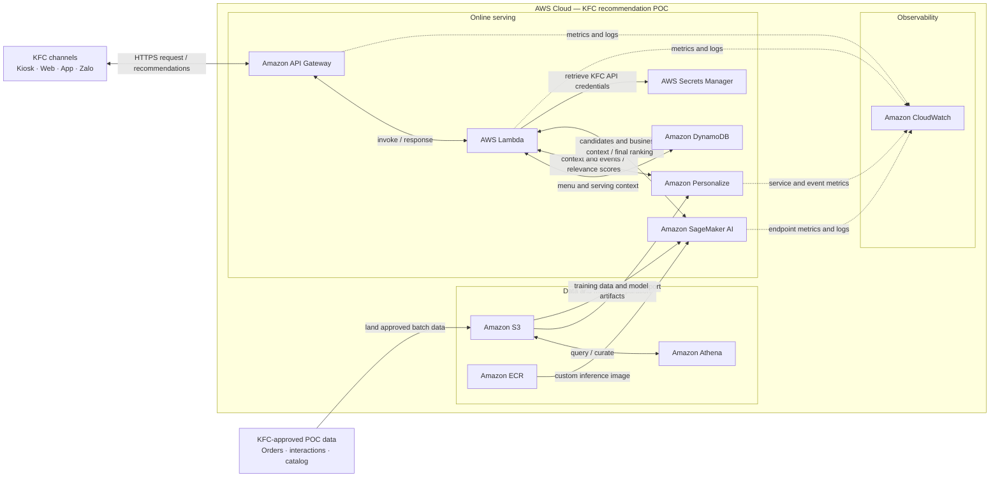

# KFC Product Recommendation POC — AWS Scope of Work and Credit Request

## 1. What are we building?

KFC is building a product recommendation engine that supports Local Favorite, For You, Modifier Upsell, and Smart Cross-sell.

## 2. What AWS services do we use?

| AWS service | Why we need it |
|---|---|
| [Amazon Personalize](https://aws.amazon.com/personalize/) | Provides one shared customer-relevance ranking component across all four recommendation types. |
| [Amazon SageMaker](https://aws.amazon.com/sagemaker-ai/) | Trains and hosts the LightGBM model that produces the final business ranking. |
| [Amazon S3](https://aws.amazon.com/s3/) | Stores raw and curated order, interaction, and catalog data, plus training artifacts and evaluation outputs. |
| [Amazon Athena](https://aws.amazon.com/athena/) | Validates and transforms data in S3 into model-ready datasets using SQL. |
| [Amazon DynamoDB](https://aws.amazon.com/dynamodb/) | Maintains a durable, freshness-bounded serving view of the current KFC menu, price, and availability. |
| [AWS Lambda](https://aws.amazon.com/lambda/) | Synchronizes KFC menu data, applies business rules, and coordinates Personalize, SageMaker, and KFC systems. |
| [Amazon API Gateway](https://aws.amazon.com/api-gateway/) | Exposes the recommendation engine through a managed API. |
| [Amazon ECR](https://aws.amazon.com/ecr/) | Stores the LightGBM inference container used by SageMaker. |
| [AWS Secrets Manager](https://aws.amazon.com/secrets-manager/) | Protects credentials used to access KFC APIs. |
| [Amazon CloudWatch](https://aws.amazon.com/cloudwatch/) | Provides logs, metrics, and alerts. |

### How the services work together

## 3. Credit request and three-year roadmap

We request **$5,000 in AWS promotional credits** for the four-week POC. The credits will support data preparation & ingestion, Personalize and SageMaker model, API and load testing, specifically design for Kiosk integration demo.

From **Year 2**, KFC begins integrating Web, App, and Zalo. Each platform is assumed to contribute recommendation traffic equal to **10% of kiosk traffic**.

| Channel or metric | Year 1 | Year 2 | Year 3 |
|---|---:|---:|---:|
| **Kiosk requests/month** | **2.4M** (200 kiosks) | **6M** (500 kiosks) | **12M** (1,000 kiosks) |
| **Web requests/month** | 0 | 600,000 | 1.2M |
| **App requests/month** | 0 | 600,000 | 1.2M |
| **Zalo requests/month** | 0 | 600,000 | 1.2M |
| **Total requests/year** | **28.8M** | **93.6M** | **187.2M** |
| **AWS budget/year** | **$11,000** | **$20,000** | **$36,000** |
