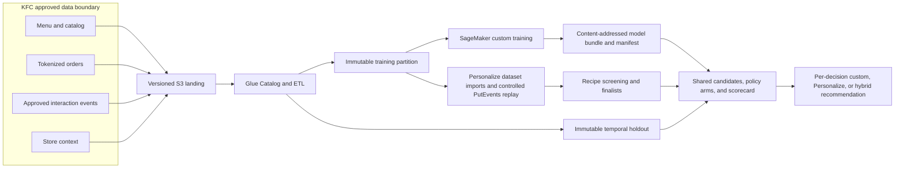
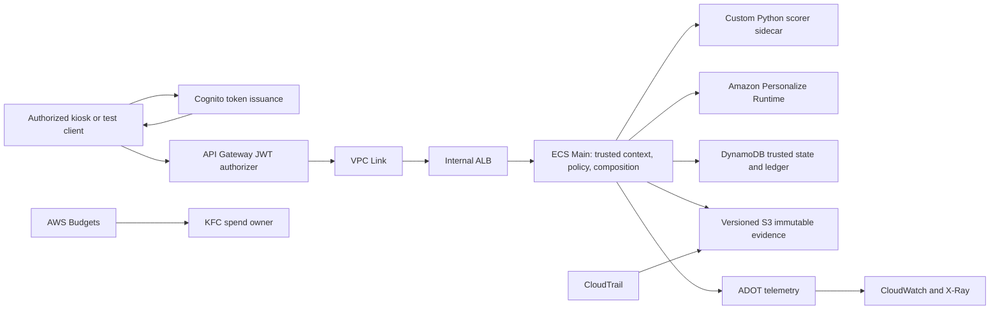

# KFC Product Recommendation POC — AWS Scope of Work and Credit Request

**Draft — For Discussion**  
**Estimate date:** 9 August 2026 | **Region:** Asia Pacific (Singapore), `ap-southeast-1` | **Execution:** four weeks

## 1. Executive scope

KFC will run a four-week, real-data, shadow-only POC to de-risk the production recommendation decision for **Local Favorite, For You, Modifier Upsell, and Smart Cross-sell**. AWS managed data, training, recommendation, security, and observability services provide a bounded comparison between operational simplicity and custom control. The existing custom scorer and Amazon Personalize remain independent ranking arms with the same KFC data cutoff, trusted context, deterministic-policy experiment, evidence contract, candidate universe, and evaluation method. A hybrid outcome means selecting different scorers for different decision types; it never chains one scorer into the other.

The current repository contains a local four-decision workbench, custom ranking path, and a production-shaped AWS CDK design. It does **not** contain verified AWS deployment, real KFC data integration, measured safe capacity, or a production release. This POC replaces the CDK topology with Terraform, deploys only the secure POC subset, evaluates both scoring paths, and produces the evidence and cost model required for a separate production decision.

The base four-week estimate is **$208.50 gross AWS usage**. A 20% contingency produces **$250.20**, rounded upward to a **$300 AWS promotional-credit request**. The low/base/high sensitivities are $146.14/$208.50/$405.76 before contingency. Gross execution spend must stop at $300 unless KFC approves a higher ceiling.

## 2. Objectives and boundaries

### Objectives

- Determine the best scoring platform per recommendation decision using reproducible real-data evidence.
- Verify ranking quality, hard-rule safety, evidence durability, latency, operability, integration effort, and gross AWS unit cost.
- Deliver full Terraform plan parity for the target topology, apply the POC subset, smoke-test it, prove teardown, and retire CDK after parity sign-off.
- Produce separate custom and Personalize/hybrid production run-rate worksheets populated after measured KFC workload inputs are approved.

### In scope

- KFC menu/catalog, tokenized order history, approved interaction events, and store context supplied to versioned Amazon S3 landing storage.
- AWS Glue Data Catalog and ETL for schema validation, quality checks, canonical feature preparation, and immutable train/evaluation cutoffs.
- Controlled replay of approved historical events through Personalize `PutEvents`; no live KFC source feed.
- Custom-model retraining in ephemeral SageMaker `ml.m5.xlarge` training jobs; content-addressed S3 model bundles and manifests; scorer serving on ECS/Fargate.
- Two-stage Personalize evaluation: offline screening of every documented-fit recipe, then timed runtime testing of finalists with at most one active real-time resource at once.
- A temporary Cognito JWT-protected HTTP API through VPC Link and an internal ALB to the private ECS service.
- Private, encrypted, single-region POC controls, observable benchmark windows, and a 30-day KFC-funded reduced decision window that retains only encrypted reports/evidence, audit logs, ECR artifacts, and Terraform state after runtime, API, ALB, and interface-endpoint teardown.

### Out of scope

Live customer exposure; causal revenue or ROI claims; automatic cart mutation; production launch, SLA, HA/DR, or 24×7 support; live KFC API or streaming integration; production traffic forecasts; taxes, support, implementation labor, and non-AWS charges.

## 3. Technical approach and AWS services

The sandbox uses a two-AZ network with one-AZ POC compute. S3 and DynamoDB use gateway endpoints. ECR API/DKR, Logs, Secrets Manager, Monitoring, X-Ray, and the Personalize control, Events, and Runtime services use nine one-AZ interface endpoints. There is no NAT gateway or public task address. KFC supplies only tokenized, approved fields and attests that extracts contain no direct PII or payment data. KMS encryption, least-privilege IAM, CloudTrail management and key S3 data events, 30-day logs, and AWS Budgets alerts at 50%, 80%, and 100% form the POC control baseline.

| Capability | AWS services | POC purpose |
|---|---|---|
| Data and preparation | S3, Glue Catalog/ETL, KMS | Approved landing, validation, canonical cutoff, feature preparation |
| Managed recommender | Amazon Personalize | Domain and custom-recipe screening, finalist inference, metadata return |
| Custom model | SageMaker training, S3 manifests, ECS/Fargate | Retrain on the same cutoff; serve an independent Python scorer |
| Trusted application/evidence | ECS/Fargate, DynamoDB, S3 | Context, policy arms, composition, immutable decisions and outcomes |
| API and identity | API Gateway HTTP API, Cognito, VPC Link, internal ALB | Restricted end-to-end kiosk/test path with scoped JWTs |
| Artifact and secrets | ECR, Secrets Manager, KMS, IAM | Immutable images, runtime secrets, encryption, least privilege |
| Operations and spend | CloudWatch, X-Ray, CloudTrail, AWS Budgets | Logs, traces, alarms, audit evidence, spend alerts |
| Infrastructure | Terraform state in encrypted S3 | Reproducible full plans, POC apply, teardown, CDK cutover |

## 4. Deliverables and acceptance

1. **Data-readiness report and entry gate:** schema, lineage, tokenization attestation, AWS recipe minimums, immutable cutoff, quality exceptions, and evaluable/not-evaluable status per cohort and decision. Before the four-week clock starts, every decision must be evaluable or KFC must approve narrowed scope and a revised cost; an unevaluable decision retains the custom path until sufficient data exists.
2. **Terraform topology:** formatting, validation, security review, and reproducible plans for foundation, platform, candidate, and production topology; applied and smoke-tested POC subset; teardown proof; CDK retirement after parity approval.
3. **Working comparison:** independent custom and Personalize scoring arms, raw and deterministic-policy-guarded Personalize outputs, shared evidence, and authenticated end-to-end test path.
4. **Evaluation report:** identical temporal holdout and candidate universe; NDCG@10 primary; precision, MRR, coverage, and cold-start strata; store/user-stratified 95% bootstrap intervals; and a KFC-approved decision-specific quality floor frozen from custom-scorer replay before results are visible.
5. **Load and durability report:** complete 5/50/100 RPS qualification profile repeated once/three/six times for low/base/high sensitivity; model-only and end-to-end latency; errors, timeouts, saturation, and evidence reconciliation.
6. **Decision scorecard:** hard-gate result and 1–5 rubric for quality 45%, operability 20%, AWS cost 15%, integration effort 10%, and evidence/explainability 10%; per-decision recommendation and production gaps.
7. **Cost and transition pack:** gross POC estimate, measured cost per 1,000 recommendations, custom and Personalize/hybrid production worksheets, Terraform inventory, artifact register, and deletion/retention disposition.

A ranking arm passes only with **zero hard-policy violations, 100% durable decision evidence, end-to-end p95 ≤250 ms, p99 ≤500 ms, and NDCG@10 at or above the frozen KFC quality floor** under the approved test. Model latency is reported separately. A raw Personalize path may remove the deterministic layer only after complete hard-rule-corpus and provenance proof; otherwise the guarded path remains. If qualifying arms are statistically tied, Personalize is preferred. If no arm clears the quality floor, the outcome is no production recommendation for that decision. Delivery still succeeds when the agreed experiments and evidence are complete.

KFC provides the dedicated account, approved spend ceiling, data, attestation, business rules, test identities, and acceptance decisions. The Implementation Team delivers the artifacts and business-hours POC support. KFC and the Implementation Team jointly accept deliverables. The AWS account team reviews the funding request and provides architecture guidance. At the $300 ceiling, nonessential active resources stop until KFC approves re-estimation. Material changes to Region, data class/volume, live exposure, recipe set, security baseline, active hours, load, retention, or production deployment require written re-estimation and approval.

## 5. Cost request and production decision

The estimate uses 28 days (672 hours) for continuous POC control-plane resources and current Singapore on-demand list prices. It excludes allowances and discounts. The fixed private network and ALB dominate the low/base cases; Personalize training and inference dominate the high variable case. Quantities, rates, and unpriced risks are in Appendix C.

| Scenario | Gross four-week AWS usage | With 20% contingency | Rounded sensitivity/request |
|---|---:|---:|---:|
| Low | $146.14 | $175.37 | $200 |
| **Base** | **$208.50** | **$250.20** | **$300 requested** |
| High | $405.76 | $486.92 | $500 |

Production is not automatically authorized by POC acceptance. KFC separately approves the per-decision architecture, workload quantities, data controls, operating model, and spend. The 30-day reduced bridge is outside the $208.50 estimate and $300 request; KFC funds its encrypted artifact/audit storage. If production approval is delayed beyond that window, KFC data and temporary artifacts are deleted unless KFC approves an extension and its AWS cost.

---

# Appendices

## Appendix A — Data, training, and evaluation flow

## Appendix B — Serving, security, and evidence flow

## Appendix C — POC estimate assumptions and service totals

### Scenario quantities

| Input | Low | Base | High |
|---|---:|---:|---:|
| Tokenized users / interactions | 50,000 / 0.5M | 100,000 / 1M | 250,000 / 5M |
| Personalize active-resource hours | 32 | 64 | 128 |
| Legacy Personalize training-hours | 6 | 15 | 30 |
| V2 full interaction passes | 2 | 4 | 8 |
| SageMaker `ml.m5.xlarge` training-hours | 10 | 25 | 50 |
| Fargate 1-vCPU/3-GiB aggregate task-hours | 32 | 96 | 256 |
| Glue DPU-hours | 10 | 25 | 50 |
| Qualification-profile runs / HTTP calls | 1 / 148,350 | 3 / 445,050 | 6 / 890,100 |
| Logs / retained data / transfer | 5 / 10 / 1 GB | 20 / 50 / 5 GB | 50 / 200 / 20 GB |

Personalize hours are divided equally among domain, v2, and legacy resources; one runtime resource is active at once. V2 and legacy campaigns use the 1-TPS minimum for their active hours and return item metadata. Personalize ingestion uses the full retained-data sensitivity. Retained data is split 50/50 between S3 and DynamoDB. Twenty-five internal Cognito Essentials MAUs, two KMS keys, three secrets, 5 GB ECR storage, nine one-AZ interface endpoints, one continuously provisioned internal ALB, and a conservative continuous 1 LCU are included.

### Service-family totals

| Family | Low | Base | High | Principal billable dimensions |
|---|---:|---:|---:|---|
| Personalize | $18.18 | $42.59 | $157.05 | Ingestion, recommender-hours, interaction passes, normalized training, minimum inference, metadata |
| Compute and ETL | $9.00 | $23.36 | $50.15 | SageMaker hours, Fargate ARM task-hours, Glue DPU-hours |
| Observability | $4.47 | $17.05 | $41.40 | CloudWatch ingestion/storage and modeled X-Ray traces |
| Data and transfer | $2.60 | $11.13 | $38.97 | S3/DynamoDB storage and requests, egress |
| Network | $100.94 | $100.98 | $101.13 | ALB hours/LCUs, nine interface endpoints, endpoint processing |
| Control, security, governance | $10.95 | $13.40 | $17.07 | API, Cognito, KMS, Secrets, ECR, CloudTrail, Budgets |
| **Total** | **$146.14** | **$208.50** | **$405.76** | Gross four-week on-demand estimate |
Totals use unrounded service-family amounts; displayed two-decimal family rows may differ from the total by up to $0.01.

Rates were frozen from official AWS regional price catalogs on 9 August 2026. Unpriced risks: cross-AZ bytes; traffic above Personalize minimum TPS; CloudWatch custom metric/alarm/dashboard and query quantities; SageMaker attached storage; Glue crawler/catalog extras; payloads over API Gateway metering units; and data events beyond the modeled evidence calls. Personalize dataset users are not Cognito MAUs; only 25 internal testers are modeled. Actual KFC authentication scope would require re-estimation.

## Appendix D — Personalize fit and selection rubric

| Decision | Personalize arms screened | Required application responsibility |
|---|---|---|
| Local Favorite | Most Viewed, Best Sellers, Popularity-Count, Trending-Now, Personalized-Ranking-v2 | Define store cluster/window, current-store availability, minimum support, tie-breaking |
| For You | ECOMMERCE Recommended for You, User-Personalization-v2 | Permit repeat purchases; trusted identity, consent, eligibility, fallback |
| Modifier Upsell | Frequently Bought Together, Similar-Items, Personalized-Ranking-v2; Semantic-Similarity only if Singapore verification passes | Generate legal modifier set; size/group/allergen/price/availability rules |
| Smart Cross-sell | Frequently Bought Together, Similar-Items, Personalized-Ranking-v2 | Multi-line cart candidates, exclusions, deduplication, diversity, budget and composition |

The same temporal cutoff, candidate universe, and deterministic policy version apply to comparable arms. Data below Personalize eligibility or KFC quality floors is not synthetically inflated: before execution, KFC either supplies sufficient approved data or narrows the affected decision and reapproves cost; after execution starts, an unevaluable Personalize arm leaves the custom path in place and is reported as insufficient evidence.

## Appendix E — Production run-rate worksheets

### Custom scorer

| Input required from KFC/POC | Low | Base | High | Monthly formula |
|---|---:|---:|---:|---|
| Average / peak recommendation RPS |  |  |  | Requests/month and autoscaling envelope |
| Minimum / average / maximum ECS tasks |  |  |  | vCPU-hours + GiB-hours |
| API calls and ALB LCU profile |  |  |  | HTTP API calls + ALB-hours + max hourly LCU dimensions |
| DynamoDB reads/writes and item sizes |  |  |  | RRUs + WRUs + storage + PITR |
| Evidence objects, requests, retained GB |  |  |  | S3 GB-month + PUT/GET + lifecycle |
| Training instance-hours and cadence |  |  |  | SageMaker hours × runs/month |
| Glue DPU-hours and cadence |  |  |  | DPU-hours/month |
| Logs, traces, metrics, alarms, queries |  |  |  | Observability quantities × regional rates |
| Endpoint, cross-AZ, and egress GB |  |  |  | Endpoint-hours/GB + transfer path rates |
| **Gross monthly / annual run-rate** |  |  |  | Sum monthly; annual = monthly × 12 |

### Personalize or hybrid

| Input required from KFC/POC | Low | Base | High | Monthly formula |
|---|---:|---:|---:|---|
| Unique users by recommender |  |  |  | Domain recommender-hours by user tier |
| Uploaded data GB and interaction growth |  |  |  | Ingestion GB |
| Interactions considered and train cadence |  |  |  | V2 interaction-passes or legacy normalized training-hours |
| Requests/TPS and active hours by decision |  |  |  | max(actual, minimum TPS) × inference rate |
| Metadata-return requests |  |  |  | Recommendation requests × metadata rate |
| Shared policy/API ECS task envelope |  |  |  | Fargate vCPU/GiB-hours |
| Shared API, DynamoDB, evidence, network, observability |  |  |  | Same measured dimensions as custom worksheet |
| **Gross monthly / annual run-rate** |  |  |  | Sum monthly; annual = monthly × 12 |

Unit cost for both candidates is `gross monthly AWS run-rate ÷ monthly recommendations × 1,000`.

## Appendix F — AWS account-team confirmation checklist

- Funding vehicle and internal sponsor for a customer-led, non-partner implementation.
- Dedicated KFC AWS account and payer/Organizations credit-sharing treatment.
- Approved amount, eligible services, deposit mechanism, redemption date, expiry date, and milestone evidence.
- Treatment of existing credits, commercial discounts, and other AWS incentives.
- Written confirmation for Personalize, SageMaker, Glue, networking, observability, and security-service eligibility.
- Required architecture, security, calculator-export, utilization, and final-outcome artifacts.
- KFC-approved gross spend ceiling if the AWS award is below $300 or actual usage exceeds the estimate.

## Appendix G — Official source register

### Scope, funding, and estimation

1. [AWS Promotional Credit Terms and Conditions](https://aws.amazon.com/awscredits/)
2. [AWS funding benefits for partners](https://aws.amazon.com/partners/funding/)
3. [AWS Partner Central — creating a fund request](https://docs.aws.amazon.com/partner-central/latest/getting-started/create-fund-request.html)
4. [AWS Partner Central Project API](https://docs.aws.amazon.com/partner-central/latest/APIReference/API_Project.html)
5. [AWS Clean Rooms POC scoping example](https://aws.amazon.com/blogs/big-data/aws-clean-rooms-proof-of-concept-scoping-part-1-media-measurement/)
6. [Amazon Redshift POC playbook](https://docs.aws.amazon.com/redshift/latest/dg/proof-of-concept-playbook.html)
7. [AWS Prescriptive Guidance — architecting a successful POC](https://docs.aws.amazon.com/prescriptive-guidance/latest/gen-ai-lifecycle-operational-excellence/dev-architecting.html)
8. [AWS Pricing Calculator — getting started](https://docs.aws.amazon.com/pricing-calculator/latest/userguide/getting-started.html)
9. [AWS Pricing Calculator assumptions](https://aws.amazon.com/calculator/calculator-assumptions/)

### Personalize and ML architecture

10. [Amazon Personalize regional endpoints](https://docs.aws.amazon.com/general/latest/gr/personalize.html#personalize_region)
11. [ECOMMERCE use cases and data minimums](https://docs.aws.amazon.com/personalize/latest/dg/ECOMMERCE-use-cases.html)
12. [Personalize recipe categories](https://docs.aws.amazon.com/personalize/latest/dg/working-with-predefined-recipes.html#recipe-categories)
13. [Contextual metadata](https://docs.aws.amazon.com/personalize/latest/dg/contextual-metadata.html)
14. [Recording events and real-time influence](https://docs.aws.amazon.com/personalize/latest/dg/recording-events.html#recorded-events-influence-recommendations)
15. [Personalize filters](https://docs.aws.amazon.com/personalize/latest/dg/filter.html)
16. [Personalize promotions](https://docs.aws.amazon.com/personalize/latest/dg/promoting-items.html)
17. [Personalize evaluation metrics](https://docs.aws.amazon.com/personalize/latest/dg/working-with-training-metrics.html)
18. [Personalize data encryption](https://docs.aws.amazon.com/personalize/latest/dg/data-encryption.html)
19. [Personalize data deletion](https://docs.aws.amazon.com/personalize/latest/dg/delete-records.html)
20. [AWS Well-Architected Machine Learning Lens — architecture](https://docs.aws.amazon.com/wellarchitected/latest/machine-learning-lens/architecture-diagram.html)
21. [AWS Well-Architected Machine Learning Lens — monitoring](https://docs.aws.amazon.com/wellarchitected/latest/machine-learning-lens/monitoring.html)

### Pricing catalogs used for the estimate

22. [Amazon Personalize pricing](https://aws.amazon.com/personalize/pricing/)
23. [Amazon Personalize Singapore price catalog](https://pricing.us-east-1.amazonaws.com/offers/v1.0/aws/AmazonPersonalize/current/ap-southeast-1/index.json)
24. [SageMaker Singapore price catalog](https://pricing.us-east-1.amazonaws.com/offers/v1.0/aws/AmazonSageMaker/current/ap-southeast-1/index.json)
25. [Amazon ECS/Fargate Singapore price catalog](https://pricing.us-east-1.amazonaws.com/offers/v1.0/aws/AmazonECS/current/ap-southeast-1/index.json)
26. [AWS Glue Singapore price catalog](https://pricing.us-east-1.amazonaws.com/offers/v1.0/aws/AWSGlue/current/ap-southeast-1/index.json)
27. [CloudWatch Singapore price catalog](https://pricing.us-east-1.amazonaws.com/offers/v1.0/aws/AmazonCloudWatch/current/ap-southeast-1/index.json)
28. [X-Ray Singapore price catalog](https://pricing.us-east-1.amazonaws.com/offers/v1.0/aws/AWSXRay/current/ap-southeast-1/index.json)
29. [Amazon S3 Singapore price catalog](https://pricing.us-east-1.amazonaws.com/offers/v1.0/aws/AmazonS3/current/ap-southeast-1/index.json)
30. [DynamoDB Singapore price catalog](https://pricing.us-east-1.amazonaws.com/offers/v1.0/aws/AmazonDynamoDB/current/ap-southeast-1/index.json)
31. [Elastic Load Balancing Singapore price catalog](https://pricing.us-east-1.amazonaws.com/offers/v1.0/aws/AWSELB/current/ap-southeast-1/index.json)
32. [Amazon VPC Singapore price catalog](https://pricing.us-east-1.amazonaws.com/offers/v1.0/aws/AmazonVPC/current/ap-southeast-1/index.json)
33. [API Gateway Singapore price catalog](https://pricing.us-east-1.amazonaws.com/offers/v1.0/aws/AmazonApiGateway/current/ap-southeast-1/index.json)
34. [Cognito Singapore price catalog](https://pricing.us-east-1.amazonaws.com/offers/v1.0/aws/AmazonCognito/current/ap-southeast-1/index.json)
35. [KMS Singapore price catalog](https://pricing.us-east-1.amazonaws.com/offers/v1.0/aws/awskms/current/ap-southeast-1/index.json)
36. [Secrets Manager Singapore price catalog](https://pricing.us-east-1.amazonaws.com/offers/v1.0/aws/AWSSecretsManager/current/ap-southeast-1/index.json)
37. [Amazon ECR Singapore price catalog](https://pricing.us-east-1.amazonaws.com/offers/v1.0/aws/AmazonECR/current/ap-southeast-1/index.json)
38. [CloudTrail Singapore price catalog](https://pricing.us-east-1.amazonaws.com/offers/v1.0/aws/AWSCloudTrail/current/ap-southeast-1/index.json)
39. [AWS Budgets price catalog](https://pricing.us-east-1.amazonaws.com/offers/v1.0/aws/AWSBudgets/current/index.json)
40. [Amazon Personalize interface VPC endpoints](https://docs.aws.amazon.com/personalize/latest/dg/vpc-interface-endpoints.html)
