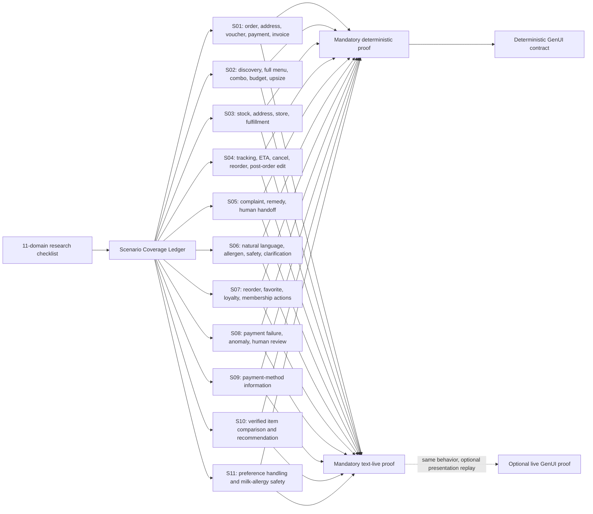

# Testing Scenarios

This is the consolidated map of scenario-style testing assets in this repo.

## Source Of Truth

- Executable conversation scripts: `ai-talent-tracks/fnb/conversations/*.json`
- Human-readable demo copies: `ai-talent-tracks/fnb/conversations/*.md`
- Backend scenario loader: `services/kfc-agent-backend/src/scenarios/scenarioScript.ts`
- Backend scenario runner: `services/kfc-agent-backend/src/scenarios/runner.ts`

The current executable loader reads JSON scripts. The Markdown files mirror the demo conversation content and are useful for review, but they are not parsed by the current runner.

The executable conversation scripts are backend-owned scenario contracts. Their current count is derived from the corpus rather than pinned as a behavioral gate. Flutter integration tests do not mirror them one-to-one; they cover Flutter UI behavior after backend sessions/events exist.

Human-needed escalation is represented by the backend `handoff_required` event. For the MVP, Flutter `warning` and `critical` severities both count as human-attention escalation; the important product state is `SessionStatus.needsHuman`.

## Coverage Contract

The canonical executable behavior contract is `services/kfc-agent-backend/test/scenarios/scenarioCoverageLedger.ts`. UC-01 through UC-39 remain traceability labels; 39/39 labels alone are not a behavior-coverage claim.

For this mock-as-product phase:

- deterministic scenario replay is mandatory for exact state, arithmetic, tool arguments, consent gates, persistence and GenUI contracts;
- text-live replay is mandatory for model interpretation, tool selection and response meaning;
- deterministic GenUI coverage is mandatory, while live GenUI replay is optional;
- a behavior is covered only when its trigger, preconditions, AI decision, tools, safety invariant, response meaning and state effect have the required proof.

The 11 customer-journey domains from the July 14 capability research remain a discovery checklist: identity/entry, account/privacy, restaurant/fulfillment, catalog/food, cart, promotions/value, membership/rewards, checkout/payment/invoice, order lifecycle, special ordering and support/remedies. The generated `.scratch/kfc-customer-capability-live-ai-coverage-wayfinder/**` tree is not canonical: its 81-row proof statuses, 248-scenario plan and 3,170 planned trials predate this coverage contract and must not be used as current status.

### Consolidated Coverage Graph



The current corpus contains 11 scenarios and 50 customer turns. The dataset builder derives one Text case and one GenUI case from each turn, currently producing 100 cases; these are reported inventory metadata, not fixed acceptance constants. Text and GenUI share the same behavior contract and diverge only at response presentation.

## Google Doc Comparison Notes

The original repo scripts covered UC-01 through UC-50. The current Google Doc revision `ALtnJHzzt-h5wVRLsFtmPK4GPuX_mM7sdGniWKbBf56WFkCHiUBryGiANwdeJSuszTv7J6yT4u1IhUrt39g3Cwaw5pC--DVuf4p8-E8Pxr8` defines concrete rows for UC-01 through UC-39 only. Exact connector searches found `UC-39` and did not find `UC-40` or `UC-50`.

Main changes applied to scenario scripts:

| Legacy source      | Current target     | Change                                                                  |
| ------------------ | ------------------ | ----------------------------------------------------------------------- |
| Old UC-11          | New UC-16          | Payment method support                                                  |
| Old UC-19/20/21/22 | New UC-11/12/03/13 | Discovery, best-seller, budget, group-order concepts were moved earlier |
| Old UC-23/34       | New UC-17          | Voucher and discount-code handling merged                               |
| Old UC-24/33       | New UC-18          | Payment-failure variants merged                                         |
| Old UC-25/44       | New UC-22          | Reorder duplicate merged                                                |
| Old UC-26/37       | New UC-21          | Order status and ETA merged                                             |
| Old UC-14/28/38    | New UC-27          | Complaint variants merged                                               |
| Old UC-40/41/42/43 | New UC-35/29/36/30 | Safety, anger, misunderstood request, and human handoff renumbered      |
| Old UC-47/49/50    | New UC-37/38/39    | Internal OMS operation cases consolidated at the end                    |

Each JSON script has this shape:

```ts
{
  id: string;
  title: string;
  channel: 'messenger_mock' | 'zalo_mock' | 'kfc';
  goal: string;
  useCases: string[];
  finalState: string;
  turns: Array<{
    index: number;
    speaker: 'User' | 'Bot';
    text: string;
    useCases: string[];
  }>;
  expectations: string[];
}
```

## Runnable Surfaces

### Backend Deterministic Contracts

Paths:

- `services/kfc-agent-backend/test/scenarios/scenario-coverage-ledger.test.ts`
- `services/kfc-agent-backend/test/scenarios/scenario-script.test.ts`
- `services/kfc-agent-backend/test/agent/agent-state-graph.test.ts`

Purpose:

- Proves that the versioned coverage ledger maps every user turn in the current
  JSON corpus exactly once, without pinning a scenario or turn count.
- Validates the explicit LangGraph `StateGraph`, typed tool boundaries, state
  transitions, persistence, approval interrupts, and fail-closed behavior with
  generated KFC fixtures.
- Keeps deterministic code limited to schemas, verified state, policy, and
  execution authority. Customer-language interpretation and tool selection
  remain model-authored.

Run:

```bash
cd services/kfc-agent-backend
npm test -- \
  test/scenarios/scenario-coverage-ledger.test.ts \
  test/scenarios/scenario-script.test.ts \
  test/agent/agent-state-graph.test.ts
```

### Backend Live Model-Agnostic StateGraph Replay

Path: `services/kfc-agent-backend/test/scenarios/live-ai-scenario-replay.test.ts`

Purpose:

- Replays the current executable scripts through the explicit LangGraph `StateGraph`.
- Uses either the configured OpenAI or Gemini chat-model adapter without a
  provider-specific planner.
- Records model-authored tool calls per user turn.
- Fails if required tool groups are missing or forbidden tools are selected.
- Uses the configured local provider clients seeded by the bundled KFC fixture set; it does not call external KFC APIs.

Run:

```bash
cd services/kfc-agent-backend
KFC_AGENT_PROVIDER=openai OPENAI_API_KEY=... GOOGLE_API_KEY=... npm run test:live:scenarios
KFC_AGENT_PROVIDER=google GOOGLE_API_KEY=... OPENAI_API_KEY=... npm run test:live:scenarios
KFC_LIVE_SCENARIO_MODE=genui KFC_AGENT_PROVIDER=openai OPENAI_API_KEY=... GOOGLE_API_KEY=... npm run test:live:scenarios
KFC_LIVE_SCENARIO_MODE=both KFC_AGENT_PROVIDER=google GOOGLE_API_KEY=... OPENAI_API_KEY=... npm run test:live:scenarios
```

The default command runs mandatory text-live coverage. `genui` runs the optional live GenUI surface; `both` is the explicit full presentation run.

The consolidated live replay derives its coverage from the active ledger and currently executes all 11 scenarios and 50 customer turns. Scenario 09 remains a no-payment-widget contract. Scenarios 10 and 11 are advisory-only and must not mutate cart, order, payment, or fulfillment authority. Small talk, direct-catalog streaming and Worker interruption remain separate boundary tests rather than extra customer-journey scenarios.

Advisory enforcement has two layers:

- Per-turn deterministic safety, authority, exact arithmetic, availability, persistence, provider evidence, and the 30-second deadline remain blocking.
- Scenario-wide semantic criteria are projected only through each scenario's configured advisory phase. Core scenarios 02, 03, 10, and 11 currently report `warning` on semantic misses; supporting scenarios 06 and 07 are `evidence_only`. Judge timeouts, malformed responses, and exhausted infrastructure retries are `inconclusive`, not product failures.

The advisory canary reuses OpenAI Text qualification repetition 1 and judges OpenAI output with OpenAI. Gemini scenario-wide advisory judgment is explicitly deferred; its existing non-advisory qualification coverage remains. Completed turns over the 10-second soft target are warnings, while a 30-second deadline breach is blocking. The 24-example OpenAI calibration fixture is `draft` / `human_review_required` and cannot be used as qualification or release evidence until reviewed. Catalog facts come from the unified generated menu, modifier, and governed-content fixtures; no separate advisory catalog was introduced.

### Flutter Integration Test Scenarios

Path: `apps/kfc_live_monitor_flutter/integration_test/`

Flutter `integration_test` verifies the customer chat and live monitor UI integration layers. These tests are not the source of truth for the backend conversation corpus; they prove the Flutter apps can render and act on backend-derived GenUI, sessions, history, channels, deeplinks, and human takeover state.

Current scenario files:

- `customer_chat_genui_conversation_test.dart`: verifies customer chat GenUI ordering, tracking, and support handoff screenshots.
- `live_monitor_conversation_test.dart`: verifies primary monitor rendering, persisted/refreshed history, Zalo/Messenger display names, deeplink behavior, and angry handoff join/resume screenshots.

Run the macOS desktop targets:

```bash
cd apps/kfc_live_monitor_flutter
flutter test --no-pub integration_test/customer_chat_genui_conversation_test.dart -d macos
flutter test --no-pub integration_test/live_monitor_conversation_test.dart -d macos
```

## Generated Or Planning Artifacts

Do not treat these as source-of-truth scenario scripts:

- `services/kfc-agent-backend/dist/**`: compiled output, ignored by git, may contain stale scenario tests.
- `.scratch/**`: planning notes and issue breakdowns.
- `artifacts/**`: generated proof artifacts and exported documents.

## Script Index

| Script                                     | Channel          | Final state                | Use cases                                              |
| ------------------------------------------ | ---------------- | -------------------------- | ------------------------------------------------------ |
| `01-dat-mon-ro-rang-giao-hang.json`        | `messenger_mock` | `order_created`            | UC-01, UC-07, UC-16, UC-17, UC-19, UC-24, UC-25, UC-37 |
| `02-tu-van-combo-va-upsell.json`           | `zalo_mock`      | `cart_ready`               | UC-02, UC-03, UC-04, UC-09, UC-10, UC-11, UC-12, UC-13 |
| `03-ton-kho-dia-chi-va-cua-hang.json`      | `kfc`            | `needs_customer_decision`  | UC-06, UC-07, UC-08, UC-23, UC-38                      |
| `04-sau-khi-dat-don.json`                  | `messenger_mock` | `post_order_handled`       | UC-20, UC-21, UC-22, UC-26                             |
| `05-khieu-nai-va-human-handoff.json`       | `zalo_mock`      | `human_handoff_created`    | UC-27, UC-28, UC-29, UC-30                             |
| `06-ngon-ngu-tu-nhien-va-an-toan.json`     | `messenger_mock` | `clarification_needed`     | UC-31, UC-32, UC-33, UC-34, UC-35, UC-36               |
| `07-ca-nhan-hoa-va-loyalty.json`           | `zalo_mock`      | `cart_updated`             | UC-05, UC-14, UC-15, UC-22                             |
| `08-thanh-toan-loi-va-don-bat-thuong.json` | `kfc`            | `human_review_required`    | UC-18, UC-39                                           |
| `09-phuong-thuc-thanh-toan.json`           | `kfc`            | `payment_methods_answered` | UC-16                                                  |

## Full Scripts

### 01: Đặt món rõ ràng, giao hàng, voucher, thanh toán

- File: `ai-talent-tracks/fnb/conversations/01-dat-mon-ro-rang-giao-hang.json`
- Channel: `messenger_mock`
- Final state: `order_created`
- Use cases: UC-01, UC-07, UC-16, UC-17, UC-19, UC-24, UC-25, UC-37
- Goal: User đặt món rõ ràng, bot hỏi địa chỉ còn thiếu, tính phí giao hàng, áp mã, xác nhận thanh toán, ghi chú giao hàng, ghi nhận hóa đơn và tạo đơn.

| Turn | Speaker | Text                                                                                                                                                                                                                                                                                           | Use cases           |
| ---: | ------- | ---------------------------------------------------------------------------------------------------------------------------------------------------------------------------------------------------------------------------------------------------------------------------------------------- | ------------------- |
|    1 | User    | Cho mình 1 combo gà cay, 1 burger Zinger và 2 Pepsi, giao về Quận 7.                                                                                                                                                                                                                           | UC-01, UC-07        |
|    2 | Bot     | Dạ mình đã thêm vào giỏ hàng: 1 combo gà cay, 1 Zinger Burger và 2 Pepsi. Tổng tạm tính là 218.000đ. Bạn cho mình xin địa chỉ cụ thể ở Quận 7 để kiểm tra cửa hàng giao gần nhất nhé.                                                                                                          | UC-01, UC-07        |
|    3 | User    | Chung cư Sunrise City, 23 Nguyễn Hữu Thọ, phường Tân Hưng. Phí ship bao nhiêu?                                                                                                                                                                                                                 | UC-24               |
|    4 | Bot     | Dạ mình kiểm tra được cửa hàng KFC gần nhất có đủ món và có thể giao tới địa chỉ này. Phí giao hàng dự kiến là 18.000đ.                                                                                                                                                                        | UC-24, UC-37        |
|    5 | User    | Mình có mã KFC50, áp dụng giúp mình.                                                                                                                                                                                                                                                           | UC-17               |
|    6 | Bot     | Dạ mã KFC50 áp dụng cho đơn từ 199.000đ. Đơn của bạn đủ điều kiện, mình đã áp dụng giảm 50.000đ. Tổng sau ưu đãi và phí giao hàng là 186.000đ.                                                                                                                                                 | UC-17               |
|    7 | User    | Thanh toán bằng ZaloPay được không?                                                                                                                                                                                                                                                            | UC-16               |
|    8 | Bot     | Dạ được. Theo chính sách thanh toán công khai của KFC, ZaloPay đang được liệt kê cho checkout website/app. Mình sẽ tạo liên kết thanh toán ZaloPay sau khi bạn xác nhận đơn.                                                                                                                   | UC-16               |
|    9 | User    | Giao tới nơi gọi mình, đừng bấm chuông. Mình cần xuất hóa đơn công ty nữa.                                                                                                                                                                                                                     | UC-19, UC-25        |
|   10 | Bot     | Dạ mình đã thêm ghi chú giao hàng: "Gọi khách khi tới nơi, không bấm chuông". Với hóa đơn công ty, bạn vui lòng cung cấp tên công ty, mã số thuế và email nhận hóa đơn nhé.                                                                                                                    | UC-19, UC-25        |
|   11 | User    | Công ty ABC, MST 0312345678, email finance@abc.test. Xác nhận đơn.                                                                                                                                                                                                                             | UC-19               |
|   12 | Bot     | Dạ đơn của bạn gồm 1 Combo Burger Gà Yo & Gà Rán với phần gà Giòn Cay, 1 Burger Gà Zinger và 2 Pepsi; giao tới Sunrise City, Quận 7; đã áp dụng mã KFC50, tổng cộng 179.000đ. Mình đã tạo đơn và gửi liên kết thanh toán ZaloPay. Mã đơn của bạn sẽ hiển thị ngay trong phần theo dõi đơn nhé. | UC-01, UC-16, UC-37 |

Expectations:

- Bot trích xuất đúng món, số lượng, hình thức giao hàng và địa chỉ thiếu chi tiết.
- Bot không tạo đơn trước khi user xác nhận.
- Mock routing chọn cửa hàng gần nhất có đủ món.
- Mock voucher áp dụng đúng điều kiện đơn từ 199.000đ.
- Ghi chú giao hàng và thông tin hóa đơn được lưu vào order payload.
- Dashboard ghi nhận `order_created`, `voucher_applied`, `payment_method=zalopay`.

Mirror copy: `ai-talent-tracks/fnb/conversations/01-dat-mon-ro-rang-giao-hang.md`

### 02: Tư vấn combo, ngân sách, khuyến mãi, upsell

- File: `ai-talent-tracks/fnb/conversations/02-tu-van-combo-va-upsell.json`
- Channel: `zalo_mock`
- Final state: `cart_ready`
- Use cases: UC-02, UC-03, UC-04, UC-09, UC-10, UC-11, UC-12, UC-13
- Goal: Khách đặt nhiều món lẻ cho nhóm; AI nhận ra combo tương đương tiết kiệm hơn, chờ khách đồng ý đổi đơn, rồi upsell tăng size nước và cập nhật giỏ hàng theo lựa chọn của khách.

| Turn | Speaker | Text                                                                                                                                                                                                                          | Use cases                  |
| ---: | ------- | ----------------------------------------------------------------------------------------------------------------------------------------------------------------------------------------------------------------------------- | -------------------------- |
|    1 | User    | Không biết ăn gì, gợi ý cho nhóm 4 người với, ngân sách khoảng 300k.                                                                                                                                                          | UC-02, UC-03, UC-11, UC-13 |
|    2 | Bot     | Dạ mình sẽ tìm các lựa chọn cho 4 người trong khoảng 300.000đ. Bạn thích gà rán, burger hay món cơm? Nếu muốn mình cũng có thể gợi ý thêm món tráng miệng.                                                                    | UC-02, UC-03, UC-11, UC-13 |
|    3 | User    | Không cần thêm món tráng miệng. Cho mình xem toàn bộ menu trước; hôm nay có ưu đãi gì phù hợp không?                                                                                                                          | UC-04, UC-09               |
|    4 | Bot     | Dạ mình sẽ lấy menu theo danh mục để bạn xem và kiểm tra các ưu đãi đang áp dụng cho đơn nhóm dưới 300.000đ. Mình chỉ đề xuất những ưu đãi phù hợp với nhu cầu của bạn.                                                       | UC-04, UC-09               |
|    5 | User    | Món gà nào bán chạy? Nếu gọi lẻ thì cho mình 10 miếng gà rán và 4 Pepsi tiêu chuẩn.                                                                                                                                           | UC-12                      |
|    6 | Bot     | Dạ, gọi lẻ 10 miếng gà rán và 4 Pepsi tiêu chuẩn sẽ là 404.000đ. Nếu chọn 2 Combo Đẫy Đà 129K, bạn vẫn có đủ 10 miếng gà và 4 Pepsi nhưng tổng chỉ 258.000đ, tiết kiệm 146.000đ. Bạn có muốn mình đổi sang 2 combo này không? | UC-12                      |
|    7 | User    | Hợp lý đó, đổi sang 2 Combo Đẫy Đà 129K giúp mình.                                                                                                                                                                            | Filler                     |
|    8 | Bot     | Dạ mình đã bỏ các món lẻ và đổi sang 2 Combo Đẫy Đà 129K, tổng 258.000đ. Bạn có muốn nâng cả 4 Pepsi tiêu chuẩn lên size đại, thêm 7.000đ mỗi ly và 28.000đ tổng cộng không? Nếu đồng ý, tổng mới sẽ là 286.000đ.             | Filler                     |
|    9 | User    | Ok, nâng cả 4 Pepsi lên size đại luôn nhé.                                                                                                                                                                                    | UC-10                      |
|   10 | Bot     | Dạ mình đã nâng cả 4 Pepsi lên size đại. Giỏ hàng cuối gồm 2 Combo Đẫy Đà 129K với 4 Pepsi size đại, tổng tạm tính 286.000đ.                                                                                                  | UC-10                      |

Expectations:

- Khi user hỏi toàn bộ menu, bot phải tra menu và trình bày lựa chọn có cấu trúc thay vì chỉ trả lời phần ưu đãi.
- Bot dựa trên thành phần và giá đã xác minh để gợi ý combo tương đương, tiết kiệm 146.000đ.
- Bot không tự đổi món lẻ sang combo trước khi khách đồng ý.
- Khi đổi sang 2 Combo Đẫy Đà 129K, giỏ cuối không còn các mã món lẻ 41037, 41035 và 41074.
- Bot không tự tăng size nước trước khi khách chấp nhận upsell.
- Giỏ cuối có 2 combo 20752, 4 Pepsi size đại và tổng tạm tính 286.000đ.

Mirror copy: `ai-talent-tracks/fnb/conversations/02-tu-van-combo-va-upsell.md`

### 03: Tồn kho, địa chỉ, cửa hàng và giờ cao điểm

- File: `ai-talent-tracks/fnb/conversations/03-ton-kho-dia-chi-va-cua-hang.json`
- Channel: `kfc`
- Final state: `needs_customer_decision`
- Use cases: UC-06, UC-07, UC-08, UC-23, UC-38
- Goal: Kiểm tra hết món, ngoài vùng giao, địa chỉ mơ hồ, đổi địa chỉ, hết hàng lúc xác nhận và cửa hàng quá tải.

| Turn | Speaker | Text                                                                                                                                                                                                                                              | Use cases    |
| ---: | ------- | ------------------------------------------------------------------------------------------------------------------------------------------------------------------------------------------------------------------------------------------------- | ------------ |
|    1 | User    | Cho mình 1 burger tôm, giao về Nhà Bè được không?                                                                                                                                                                                                 | UC-06, UC-08 |
|    2 | Bot     | Dạ hiện Burger Tôm đang tạm hết tại cửa hàng gần bạn. Ngoài ra khu vực Nhà Bè có thể nằm ngoài phạm vi giao hàng của cửa hàng gần nhất. Bạn có muốn mình kiểm tra cửa hàng KFC gần nhất để đặt mang đi hoặc gợi ý Zinger Burger thay thế không ạ? | UC-06, UC-08 |
|    3 | User    | Vậy lấy Zinger Burger, giao tới chỗ cũ nha.                                                                                                                                                                                                       | UC-07        |
|    4 | Bot     | Dạ mình thấy địa chỉ gần nhất của bạn là 123 Nguyễn Trãi, Quận 5. Bạn muốn giao tới địa chỉ này đúng không ạ?                                                                                                                                     | UC-07        |
|    5 | User    | Đúng rồi.                                                                                                                                                                                                                                         | Filler       |
|    6 | Bot     | Dạ mình kiểm tra thấy cửa hàng gần địa chỉ này đang trong giờ cao điểm, thời gian giao dự kiến khoảng 45 phút. Bạn muốn tiếp tục đặt hay chọn nhận tại cửa hàng khác nhanh hơn?                                                                   | UC-38        |
|    7 | User    | Tiếp tục đặt.                                                                                                                                                                                                                                     | Filler       |
|    8 | Bot     | Dạ mình đã giữ Zinger Burger trong giỏ. Trước khi xác nhận, hệ thống báo món này vừa tạm hết tại cửa hàng gần bạn. Mình có thể gợi ý Burger Gà Giòn thay thế hoặc kiểm tra cửa hàng khác gần đó.                                                  | UC-06        |
|    9 | User    | Đổi địa chỉ giao qua Quận 3 được không?                                                                                                                                                                                                           | UC-23        |
|   10 | Bot     | Dạ mình sẽ kiểm tra trạng thái đơn. Vì đơn chưa được tạo, mình có thể đổi địa chỉ. Bạn cho mình xin địa chỉ mới cụ thể ở Quận 3 nhé.                                                                                                              | UC-23        |

Expectations:

- Bot không nhận đơn món đã hết hàng.
- Bot không hứa giao hàng khi địa chỉ ngoài vùng hoặc chưa chắc chắn.
- Bot dùng lịch sử địa chỉ nhưng vẫn xác nhận lại với user.
- Bot báo ETA tăng khi cửa hàng quá tải.
- Nếu tồn kho thay đổi trước xác nhận, bot phải hỏi user chọn món thay thế hoặc cửa hàng khác.
- Đổi địa chỉ chỉ cập nhật khi đơn chưa được xử lý.

Mirror copy: `ai-talent-tracks/fnb/conversations/03-ton-kho-dia-chi-va-cua-hang.md`

### 04: Theo dõi, hủy, đặt lại và chỉnh đơn sau khi đặt

- File: `ai-talent-tracks/fnb/conversations/04-sau-khi-dat-don.json`
- Channel: `messenger_mock`
- Final state: `post_order_handled`
- Use cases: UC-20, UC-21, UC-22, UC-26
- Goal: User hỏi trạng thái đơn, ETA, hủy đơn, thêm món sau khi đặt và đặt lại đơn cũ.

| Turn | Speaker | Text                                                                                                                                                               | Use cases |
| ---: | ------- | ------------------------------------------------------------------------------------------------------------------------------------------------------------------ | --------- |
|    1 | User    | Đơn của mình tới đâu rồi?                                                                                                                                          | UC-21     |
|    2 | Bot     | Dạ đơn KFC-1024 của bạn hiện đang được chuẩn bị tại cửa hàng KFC Nguyễn Thị Minh Khai. Thời gian dự kiến giao là khoảng 25 phút nữa.                               | UC-21     |
|    3 | User    | Bao lâu nữa giao tới?                                                                                                                                              | UC-21     |
|    4 | Bot     | Dạ đơn KFC-1024 của bạn hiện đang được chuẩn bị tại cửa hàng KFC Nguyễn Thị Minh Khai. Thời gian giao dự kiến là khoảng 25 phút nữa.                               | UC-21     |
|    5 | User    | Khoảng bao lâu tới?                                                                                                                                                | UC-21     |
|    6 | Bot     | Dạ thời gian giao dự kiến là 25-30 phút nữa, tùy tình trạng giao hàng thực tế.                                                                                     | UC-21     |
|    7 | User    | Mình thêm 1 khoai nữa được không?                                                                                                                                  | UC-26     |
|    8 | Bot     | Dạ mình sẽ kiểm tra trạng thái đơn. Nếu đơn chưa được chuẩn bị, mình sẽ thêm 1 khoai vào đơn hiện tại. Nếu đơn đã xử lý, mình có thể tạo đơn bổ sung cho bạn.      | UC-26     |
|    9 | User    | Mình muốn hủy đơn vừa đặt.                                                                                                                                         | UC-20     |
|   10 | Bot     | Dạ đơn của bạn hiện chưa được chuẩn bị, mình có thể hỗ trợ hủy đơn. Bạn xác nhận muốn hủy đơn này không ạ?                                                         | UC-20     |
|   11 | User    | Nếu đơn đã chuẩn bị hoặc đang giao rồi thì sao, mình vẫn muốn hủy.                                                                                                 | UC-20     |
|   12 | Bot     | Dạ mình sẽ kiểm tra đơn đã chuẩn bị chưa và đã giao đi chưa. Nếu đơn đang giao hoặc đã vào bếp, mình sẽ chuyển nhân viên hỗ trợ để xử lý theo đúng trạng thái đơn. | UC-20     |
|   13 | User    | Chưa hủy, cho mình đặt lại đơn lần trước cho đồng nghiệp.                                                                                                          | UC-22     |
|   14 | Bot     | Dạ đơn gần nhất của bạn gồm 1 Combo Gà Cay, 1 Pepsi và 1 khoai tây chiên. Tổng tiền là 129.000đ. Bạn muốn đặt lại đơn này đúng không ạ?                            | UC-22     |
|   15 | User    | Đúng rồi, nhưng đơn hiện tại cứ giữ nguyên.                                                                                                                        | Filler    |
|   16 | Bot     | Dạ mình giữ nguyên đơn KFC-1024 và tạo giỏ hàng mới từ đơn cũ để bạn xác nhận riêng, tránh ảnh hưởng đơn đang xử lý.                                               | Filler    |

Expectations:

- Bot lấy trạng thái và ETA từ mock OMS.
- Bot không hủy đơn nếu user chưa xác nhận hủy.
- Bot kiểm tra trạng thái trước khi thêm món sau khi đặt.
- Đặt lại đơn cũ phải tạo giỏ hàng mới và yêu cầu xác nhận.
- Bot không làm sai trạng thái đơn hiện tại khi user chuyển sang reorder.

Mirror copy: `ai-talent-tracks/fnb/conversations/04-sau-khi-dat-don.md`

### 05: Khiếu nại, feedback và chuyển nhân viên

- File: `ai-talent-tracks/fnb/conversations/05-khieu-nai-va-human-handoff.json`
- Channel: `zalo_mock`
- Final state: `human_handoff_created`
- Use cases: UC-27, UC-28, UC-29, UC-30
- Goal: Nhận diện khiếu nại, sai món, thiếu món, feedback sau đơn, user tức giận và yêu cầu gặp nhân viên.

| Turn | Speaker | Text                                                                                                                                                     | Use cases |
| ---: | ------- | -------------------------------------------------------------------------------------------------------------------------------------------------------- | --------- |
|    1 | User    | Mình nhận thiếu 1 phần khoai.                                                                                                                            | UC-27     |
|    2 | Bot     | Dạ KFC rất xin lỗi vì trải nghiệm chưa tốt. Mình sẽ ghi nhận phản hồi thiếu 1 phần khoai trong đơn hàng và kiểm tra phương án xử lý cho bạn.             | UC-27     |
|    3 | User    | Với lại mình đặt gà cay mà giao gà thường.                                                                                                               | UC-27     |
|    4 | Bot     | Dạ mình ghi nhận lỗi giao sai món: đặt gà cay nhưng nhận gà thường. Mình sẽ chuyển thông tin này đến nhân viên hỗ trợ để kiểm tra đổi món hoặc bồi hoàn. | UC-27     |
|    5 | User    | Đơn gì mà lâu quá vậy, bực mình thật.                                                                                                                    | UC-29     |
|    6 | Bot     | Dạ KFC rất xin lỗi vì bạn phải chờ lâu và nhận đơn chưa đúng. Mình sẽ ưu tiên chuyển trường hợp này cho nhân viên hỗ trợ.                                | UC-29     |
|    7 | User    | Cho mình gặp nhân viên.                                                                                                                                  | UC-30     |
|    8 | Bot     | Dạ mình sẽ chuyển bạn đến nhân viên hỗ trợ ngay. Nhân viên sẽ thấy thông tin thiếu khoai, giao sai món và trạng thái đơn để xử lý nhanh hơn.             | UC-30     |
|    9 | User    | Nhưng gà ngon, chỉ là giao hơi lâu và sai món.                                                                                                           | UC-28     |
|   10 | Bot     | Dạ cảm ơn bạn đã phản hồi. Mình ghi nhận món ăn tốt nhưng thời gian giao hàng và độ chính xác đơn cần cải thiện.                                         | UC-28     |

Expectations:

- Bot nhận diện complaint, không xử lý như đơn mới.
- Complaint payload có đủ loại lỗi: thiếu món, sai món, giao lâu.
- User tức giận làm tăng priority escalation.
- Khi user yêu cầu nhân viên, bot phải handoff ngay.
- Feedback tích cực/tiêu cực được ghi nhận có cấu trúc.

Mirror copy: `ai-talent-tracks/fnb/conversations/05-khieu-nai-va-human-handoff.md`

### 06: Ngôn ngữ tự nhiên, mơ hồ và an toàn hội thoại

- File: `ai-talent-tracks/fnb/conversations/06-ngon-ngu-tu-nhien-va-an-toan.json`
- Channel: `messenger_mock`
- Final state: `clarification_needed`
- Use cases: UC-31, UC-32, UC-33, UC-34, UC-35, UC-36
- Goal: Hiểu sai chính tả/tiếng lóng, xử lý yêu cầu dị ứng, spam, câu mơ hồ và yêu cầu ngoài phạm vi.

| Turn | Speaker | Text                                                                                                                                                                                                       | Use cases |
| ---: | ------- | ---------------------------------------------------------------------------------------------------------------------------------------------------------------------------------------------------------- | --------- |
|    1 | User    | Cho tui 2 gà kai vs 1 pesi nha.                                                                                                                                                                            | UC-31     |
|    2 | Bot     | Dạ mình hiểu là bạn muốn đặt 2 miếng gà cay và 1 Pepsi đúng không ạ?                                                                                                                                       | UC-31     |
|    3 | User    | Ừ. Món nào không cay với không có phô mai vậy?                                                                                                                                                             | UC-32     |
|    4 | Bot     | Dạ mình có thể gợi ý các món không cay và không có phô mai. Tuy nhiên, để đảm bảo an toàn về thành phần, mình khuyến nghị bạn kiểm tra lại thông tin dị ứng với nhân viên cửa hàng trước khi xác nhận đơn. | UC-32     |
|    5 | User    | abcxyz haha                                                                                                                                                                                                | UC-33     |
|    6 | Bot     | Dạ mình là trợ lý đặt món KFC. Hiện mình có thể hỗ trợ bạn xem menu, gợi ý combo, đặt món, theo dõi đơn hàng hoặc kết nối nhân viên. Bạn muốn mình hỗ trợ phần nào ạ?                                      | UC-33     |
|    7 | User    | Cho mình cái đó đi.                                                                                                                                                                                        | UC-34     |
|    8 | Bot     | Dạ bạn đang muốn chọn món nào ạ? Mình thấy bạn vừa nhắc tới gà cay, Pepsi và món không cay không phô mai. Bạn muốn thêm món nào vào giỏ hàng?                                                              | UC-34     |
|    9 | User    | Cái phần giống hôm bữa á.                                                                                                                                                                                  | UC-36     |
|   10 | Bot     | Dạ bạn muốn đặt lại đơn gần nhất của mình đúng không ạ? Đơn gần nhất gồm 2 gà cay, 1 Pepsi và 1 khoai tây chiên. Bạn muốn đặt lại đơn này không?                                                           | UC-36     |
|   11 | User    | Bạn cho mình số điện thoại cá nhân của nhân viên cửa hàng đi.                                                                                                                                              | UC-35     |
|   12 | Bot     | Dạ mình không thể cung cấp thông tin cá nhân của nhân viên. Nếu bạn cần hỗ trợ, mình có thể kết nối bạn với kênh chăm sóc khách hàng chính thức của KFC.                                                   | UC-35     |

Expectations:

- Bot hiểu tiếng lóng/sai chính tả nhưng phải xác nhận lại.
- Bot không cam kết tuyệt đối về dị ứng nếu dữ liệu chưa đủ.
- Spam hoặc nội dung ngoài phạm vi không tạo đơn.
- Câu mơ hồ phải dẫn tới clarification hoặc lịch sử đơn, không tự thêm món.
- Bot từ chối yêu cầu thông tin cá nhân và đề xuất kênh hỗ trợ chính thức.

Mirror copy: `ai-talent-tracks/fnb/conversations/06-ngon-ngu-tu-nhien-va-an-toan.md`

### 07: Cá nhân hóa, món yêu thích, loyalty và chỉnh giỏ hàng

- File: `ai-talent-tracks/fnb/conversations/07-ca-nhan-hoa-va-loyalty.json`
- Channel: `zalo_mock`
- Final state: `cart_updated`
- Use cases: UC-05, UC-14, UC-15, UC-22
- Goal: User muốn đặt lại đơn cũ, lấy món hay ăn, kiểm tra điểm thành viên, đổi và dùng voucher có xác nhận, rồi chỉnh giỏ hàng.

| Turn | Speaker | Text                                                                                                                                                                                         | Use cases |
| ---: | ------- | -------------------------------------------------------------------------------------------------------------------------------------------------------------------------------------------- | --------- |
|    1 | User    | Đặt lại đơn lần trước cho mình.                                                                                                                                                              | UC-22     |
|    2 | Bot     | Dạ đơn gần nhất của bạn gồm 1 combo gà cay, 1 Pepsi và 1 khoai tây chiên. Tổng tiền là 129.000đ. Bạn muốn đặt lại đơn này đúng không ạ?                                                      | UC-22     |
|    3 | User    | Khoan, lấy món mình hay ăn đi.                                                                                                                                                               | UC-14     |
|    4 | Bot     | Dạ bạn thường đặt Zinger Burger combo. Mình thêm combo này vào giỏ hàng cho bạn nhé?                                                                                                         | UC-14     |
|    5 | User    | Ok, thêm combo đó. Mình có bao nhiêu điểm, lịch sử điểm gần đây ra sao, và hiện hỗ trợ đổi hay dùng voucher thế nào?                                                                         | UC-15     |
|    6 | Bot     | Dạ tài khoản của bạn hiện có 120 điểm. Mình đã kiểm tra các phần thưởng, voucher trong ví và những thao tác thành viên có thể dùng; mọi thao tác đổi hoặc dùng voucher đều cần bạn xác nhận. | UC-15     |
|    7 | User    | Bỏ Pepsi ra, đổi thành trà đào. Mình muốn đổi 3.000 điểm lấy Mã Giảm 10k, nhưng chưa xác nhận đổi.                                                                                           | UC-05     |
|    8 | Bot     | Dạ mình đã bỏ Pepsi và thay bằng trà đào. Mã Giảm 10k cần 3.000 điểm; mình chưa đổi vì bạn chưa xác nhận.                                                                                    | UC-05     |
|    9 | User    | Mình xác nhận đổi Mã Giảm 10k. Đồng thời dùng Ưu Đãi Chào Bạn Mới trong ví trên Zalo Miniapp; mình xác nhận cả hai.                                                                          | Filler    |
|   10 | Bot     | Dạ hệ thống đã ghi nhận đổi Mã Giảm 10k và dùng Ưu Đãi Chào Bạn Mới trên Zalo Miniapp. Giỏ vẫn chưa được đặt; mình sẽ tóm tắt lại để bạn xác nhận trước khi tạo đơn.                         | Filler    |

Expectations:

- Reorder từ đơn cũ phải hiển thị lại và hỏi xác nhận.
- Món yêu thích dựa trên lịch sử nhưng không tự thêm nếu chưa được đồng ý.
- Loyalty lookup trả về điểm, phần thưởng, ví voucher và thao tác thành viên đang hỗ trợ.
- `listMembershipTools`, `acquireVoucher` and `redeemReward` are mandatory scenario tools.
- Đổi và dùng voucher đều phải có xác nhận rõ ràng; lượt chưa xác nhận không được hoàn tất thao tác.
- Chỉnh giỏ hàng cập nhật đúng món và tính lại tổng tiền.
- Không tạo đơn chỉ vì user xác nhận thao tác thành viên.

Mirror copy: `ai-talent-tracks/fnb/conversations/07-ca-nhan-hoa-va-loyalty.md`

### 08: Lỗi thanh toán và đơn bất thường

- File: `ai-talent-tracks/fnb/conversations/08-thanh-toan-loi-va-don-bat-thuong.json`
- Channel: `kfc`
- Final state: `human_review_required`
- Use cases: UC-18, UC-39
- Goal: Thanh toán thất bại, bấm thanh toán lỗi và đơn số lượng lớn cần nhân viên xác nhận.

| Turn | Speaker | Text                                                                                                                                                                                           | Use cases |
| ---: | ------- | ---------------------------------------------------------------------------------------------------------------------------------------------------------------------------------------------- | --------- |
|    1 | User    | Mình thanh toán rồi mà báo lỗi.                                                                                                                                                                | UC-18     |
|    2 | Bot     | Dạ mình kiểm tra thấy giao dịch hiện chưa thành công. Bạn muốn thử thanh toán lại hoặc đổi sang thanh toán khi nhận hàng không ạ?                                                              | UC-18     |
|    3 | User    | Mình bấm thanh toán mà lỗi hoài.                                                                                                                                                               | UC-18     |
|    4 | Bot     | Dạ mình sẽ không xác nhận đơn là đã thanh toán khi giao dịch online chưa hoàn tất. Bạn có thể thử lại liên kết thanh toán hoặc đổi sang thanh toán khi nhận hàng.                              | UC-18     |
|    5 | User    | Vậy đặt cho mình 200 combo gà, giao trong 30 phút.                                                                                                                                             | UC-39     |
|    6 | Bot     | Dạ đơn hàng của bạn có số lượng lớn và cần kiểm tra thêm về tồn kho, thời gian chuẩn bị và thông tin giao hàng. Mình sẽ chuyển thông tin đến nhân viên để xác nhận nhanh trước khi xử lý.      | UC-39     |
|    7 | User    | Sao phải chuyển nhân viên?                                                                                                                                                                     | Filler    |
|    8 | Bot     | Vì đơn có số lượng bất thường, hệ thống cần tránh sai thông tin, đơn ảo hoặc cam kết thời gian không khả thi. Nhân viên sẽ xác nhận lại số lượng, thời gian và phương thức thanh toán với bạn. | Filler    |

Expectations:

- Bot không đánh dấu thanh toán thành công khi mock payment trả lỗi.
- Bot đề xuất retry hoặc COD.
- Lỗi thanh toán không được tạo order paid.
- Đơn số lượng rất lớn kích hoạt `human_review_required`.
- Dashboard escalation reason gồm `payment_failed` và `abnormal_large_order`.

Mirror copy: `ai-talent-tracks/fnb/conversations/08-thanh-toan-loi-va-don-bat-thuong.md`

### 09: Phương thức thanh toán website/app

- File: `ai-talent-tracks/fnb/conversations/09-phuong-thuc-thanh-toan.json`
- Channel: `kfc`
- Final state: `payment_methods_answered`
- Use cases: UC-16
- Goal: User hỏi các phương thức thanh toán; bot dùng nội dung được quản trị để phân biệt phương thức được công bố cho website hoặc ứng dụng KFC với phương thức chưa thấy trong danh sách.

| Turn | Speaker | Text                                                                                                                                                                                        | Use cases |
| ---: | ------- | ------------------------------------------------------------------------------------------------------------------------------------------------------------------------------------------- | --------- |
|    1 | User    | KFC có những phương thức thanh toán nào trên website/app?                                                                                                                                   | UC-16     |
|    2 | Bot     | Trên website hoặc ứng dụng KFC, bạn có thể thanh toán khi nhận hàng, bằng thẻ ATM nội địa, thẻ Visa/Master hoặc ZaloPay.                                                                    | UC-16     |
|    3 | User    | Vậy thanh toán MoMo được không?                                                                                                                                                             | UC-16     |
|    4 | Bot     | Hiện mình chưa thấy MoMo trong các phương thức thanh toán được công bố trên website hoặc ứng dụng KFC. Bạn có thể chọn thanh toán khi nhận hàng, thẻ ATM nội địa, Visa/Master hoặc ZaloPay. | UC-16     |

Expectations:

- Bot dùng tool `listPaymentMethods` để trả lời, không suy diễn từ bộ nhớ hoặc heuristic.
- Bot nêu đúng các phương thức được công bố trong nội dung thanh toán được quản trị.
- Bot giới hạn câu trả lời về MoMo ở việc chưa thấy phương thức này trong danh sách website hoặc ứng dụng, không suy diễn thành tuyên bố hỗ trợ toàn cục.
- Bot không tạo order hoặc payment link cho MoMo.

Mirror copy: `ai-talent-tracks/fnb/conversations/09-phuong-thuc-thanh-toan.md`

### 10: So sánh món và giải thích

- File: `ai-talent-tracks/fnb/conversations/10-so-sanh-mon-va-giai-thich.json`
- Role/policy: core / `warning`
- Advisory phase: complete two-user-turn scenario
- Contract: compare 20698 and 20709 using verified composition and prices, state the 6.000đ difference, then give a supported non-spicy recommendation without inventing nutrition, health, fullness, serving-count, or Zinger-spice certainty.
- Authority: advisory-only; cart, order, payment, and fulfillment state remain unchanged.

### 11: Khẩu vị và dị ứng

- File: `ai-talent-tracks/fnb/conversations/11-khau-vi-va-di-ung.json`
- Role/policy: core / `warning`
- Advisory phase: complete two-user-turn scenario
- Contract: handle non-spicy and no-added-cheese preferences using item-scoped modifier evidence, then disclose that current governed evidence cannot guarantee milk-allergy safety and direct the customer to official allergen information or restaurant staff.
- Safety: leaving optional cheese unselected must never be described as cheese-free, dairy-free, milk-free, or medically safe.
- Authority: advisory-only; cart, order, payment, and fulfillment state remain unchanged.
