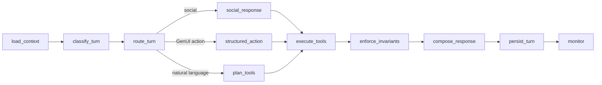

# Current Demo Failures And Commerce Fallbacks Audit

Audited: 2026-07-13 (Asia/Ho_Chi_Minh)

## Verdict

The deployed infrastructure is reachable and clean, but the KFC ordering behavior is not demo-safe. The deployed Worker is release `6f1b1e5a161f89c107a7537d3851550d16fa3fcb`; the local repair checkout is an uncommitted tree at `9667e74dab6f83dff7ca924a9438d6cfafee376b`, three commits behind that release. They are different products for proof purposes.

The local repair tree passes 128 focused deterministic tests and TypeScript compilation. A fresh live-AI replay on the same tree failed 1 of 10 tests after 232.83 seconds. Scenario 01 still failed the ordinary order-to-address transition: the mixed order ended on a Pepsi-only picker without a verified cart, and the next address/fee turn repeated `searchMenu` instead of executing `quoteFulfillment`.

Recent deployed KFC and Messenger records independently confirm stale cart/order leakage, silent address and store substitution, MoMo-to-ZaloPay substitution, response/UI contradictions, accidental multi-item cart mutations, and one accepted KFC turn that executed fulfillment and order-preview tools but never persisted or delivered an assistant turn. No current evidence proves a truthful `pending -> paid -> preparing -> out for delivery` lifecycle.

This audit therefore establishes a hard boundary for later tickets: infrastructure defaults may remain, but no customer-facing commerce fact may come from an implicit fixture, placeholder, stale journey, model inference, unknown-status label, or missing provider field.

## Snapshot boundaries

| Surface | Verified snapshot | What it proves | What it does not prove |
| --- | --- | --- | --- |
| Direct Worker | [`/ready?deep=1`](https://kfc-agent-backend-demo.thangvnv0806.workers.dev/ready?deep=1) returned `ok: true`, clean release `6f1b1e5a…`, built `2026-07-12T03:44:12Z`; database, fixtures, Messenger, OpenAI, and observability checks were green | Configuration and dependency readiness | Correct conversation behavior or parity with the local repair tree |
| Customer and monitor Pages | [`kfc-ai-chatbot.pages.dev/release.json`](https://kfc-ai-chatbot.pages.dev/release.json) and [`kfc-ai-live-monitor.pages.dev/release.json`](https://kfc-ai-live-monitor.pages.dev/release.json) both returned clean frontend release `79425fd0039114fbcf6f2a3ded39d71e6c63c2f6`, built `2026-07-12T02:23:29Z`; both proxied deep-readiness routes reached Worker `6f1b1e5a…` | Current frontend and backend bindings are reachable | A shared frontend/backend Git SHA; they are separate release artifacts |
| Local checkout | `main` at `9667e74d…`, behind `origin/main` by three commits, with 28 tracked files modified plus untracked StateGraph/test files and this Wayfinder map | The exact code audited and tested locally | Deployed behavior |
| Focused deterministic repair suite | 6 files, 128 tests, all passed in 4.52 seconds | The supplied planner, fixture, graph, selector, monitor, and failure-path contracts agree locally | Live model selection, deployed runtime, Flutter integration, or lifecycle progression |
| Fresh local live-AI replay | 9 tests passed, 1 failed; scenario 01 failed; 232.83 seconds | The known address/fee blocker still reproduces against the live planner | Release-bound deployment proof or stability |
| Latest saved passing live-AI artifact | [`29785543/provenance.json`](../../../../services/kfc-agent-backend/artifacts/live-ai-scenarios/29785543/provenance.json) records 9 scenario passes plus the UC-01..UC-39 coverage check at commit `29785543…` on 2026-07-11 | One historical pass on an older commit | Current checkout, deployed SHA, or repeated stability; nine other saved result files in the same folder fail at least one scenario |

## Current StateGraph reality

The local checkout exposes the requested graph shape and an untracked Studio entrypoint through [`langgraph.json`](../../../../services/kfc-agent-backend/langgraph.json) and [`studioAgent.ts`](../../../../services/kfc-agent-backend/src/graph/studioAgent.ts). The visible topology is:



The topology test verifies those nodes and branches in [`state-graph-migration.test.ts`](../../../../services/kfc-agent-backend/test/graph/state-graph-migration.test.ts#L17-L94), but the business decomposition is not yet real:

- `classify_turn` computes `fresh_shopping`, `active_checkout`, `post_order_support`, or `social`, but `journeyMode` has no downstream consumer ([`buildGraph.ts`](../../../../services/kfc-agent-backend/src/graph/buildGraph.ts#L2798-L2808)).
- `social_response`, `structured_action`, and `plan_tools` all call the same monolithic `runAgentTurnCore` ([`buildGraph.ts`](../../../../services/kfc-agent-backend/src/graph/buildGraph.ts#L2830-L2855)). GenUI avoids planner selection inside that core, but the graph node itself does not own structured execution.
- `execute_tools` only checks that a completed output exists; it does not execute tools ([`buildGraph.ts`](../../../../services/kfc-agent-backend/src/graph/buildGraph.ts#L2857-L2860)).
- `enforce_invariants` only rejects an order preview with no address. It does not independently enforce confirmed address, verified fulfillment, payment truth, current-journey isolation, or response/UI consistency ([`buildGraph.ts`](../../../../services/kfc-agent-backend/src/graph/buildGraph.ts#L2862-L2868)).
- `compose_response`, `persist_turn`, and `monitor` add useful empty-response recovery, persistence verification, and monitor completion checks ([`buildGraph.ts`](../../../../services/kfc-agent-backend/src/graph/buildGraph.ts#L2870-L2927)). These are meaningful reliability guards, but most commerce work still completed before the graph reached them.

The migration is therefore visually inspectable but semantically wrapper-heavy. Later implementation must either move the corresponding operations into the named nodes or rename the nodes so the visualization does not claim boundaries that do not exist.

## Capability and failure inventory

| Area | Confirmed capability | Confirmed failure or gap | Local repair status |
| --- | --- | --- | --- |
| Short menu discovery | Fresh deployed turns such as `tôi muốn pepsi` can produce a Pepsi picker. The current local selector prioritizes successful current-turn menu evidence over an old cart. | A mixed order can collapse to the last search result. In the fresh focused scenario 01 run, the first response showed only Pepsi choices and no cart. Menu browsing with old state has also exposed old payment/cart surfaces. | Deterministic Pepsi-over-cart and fresh exact-item tests pass in [`live-conversation-regressions.test.ts`](../../../../services/kfc-agent-backend/test/graph/live-conversation-regressions.test.ts#L47-L148); live multi-intent behavior still fails. |
| Menu/modifier-aware recommendation | Local search indexes product text plus nested modifier options and returns matching modifier evidence ([`orderingDataService.ts`](../../../../services/kfc-agent-backend/src/ordering/orderingDataService.ts#L312-L340)). A deterministic test finds Combo Hợp Gu and Combo Đẫy Đà for `combo gà cay` without auto-selecting either. | The deployed flow is not proven against a versioned current Catalog Observation; broad `Gợi ý combo` followed by `Xác nhận món` submitted three selected combos. Natural-language upsize and dish-composition suggestions are not covered across all compatible items. | Partial. The search primitive and one regression exist; exact compatibility, selection, and upsize contracts remain for tickets 03 and 04. |
| Cart creation and changes | Trusted GenUI `add_items` executes without planner selection; local tests cover exact item, quantity changes, and modifier changes. | Deployed sessions added two or three combos after one generic confirmation, retained old cart/order/payment state during a new journey, and built implausible 469k/917k baskets for recommendation requests. `add this` has resolved to an old payment surface. | Fresh-journey and stale-payment regressions pass locally, but the graph classifier does not own reset semantics and no deployed replay proves them. |
| Address and fulfillment | Local deterministic paths can show `missing`, present a saved address as `candidate`, require explicit acceptance, reject a partial address, and quote a complete address ([`live-conversation-regressions.test.ts`](../../../../services/kfc-agent-backend/test/graph/live-conversation-regressions.test.ts#L150-L402)). | Deployed Messenger replaced `54/2 Nguyễn Hồng Đào` with Sunrise City/Quận 7; a KFC `Tiếp tục giao hàng` turn with no supplied address quoted 18,000đ/35 minutes, assigned `KFC BIG C ĐỒNG NAI`, and previewed an order. Repeated delivery requests have returned stale carts/payment cards. | Deterministic contracts pass; current live scenario 01 still misses the quote after a typed address, and none of the fixes are deployed. |
| Payment method selection | The local safety path lists methods and blocks an unsupported MoMo request from creating a payment link ([`live-conversation-regressions.test.ts`](../../../../services/kfc-agent-backend/test/graph/live-conversation-regressions.test.ts#L404-L436)). | Deployed replies said “Ví MoMo” while returning `https://pay.mock/zalopay/...`, or said MoMo was unsupported while still creating a ZaloPay link. Flutter also turns a missing `open_payment` value into the word `MoMo`. | Deterministic MoMo non-substitution passes; deployed proof is absent. |
| Payment truth | Local `I paid` handling calls `checkPaymentStatus` and keeps a provider-returned `pending` status pending ([`live-conversation-regressions.test.ts`](../../../../services/kfc-agent-backend/test/graph/live-conversation-regressions.test.ts#L438-L480)). | The normal mock client never advances payment successfully unless a provider is injected. The Flutter fixture action claims payment succeeded without checking a provider. No current deployed trace proves a controlled pending-to-paid transition. | Fail-closed check exists locally; lifecycle simulation is missing. |
| Order and delivery status | Order lookup and tracking tools exist, and seeded scenario tests can return a stored order. | Default mock order status is static, payment does not naturally progress, and delivery exposes a quote but no controlled preparation/out-for-delivery progression. Unknown status can be rendered as “đang được xử lý.” | No truthful end-to-end lifecycle proof. Ticket 06 must provide explicit scenario-scoped controls. |
| Response reliability | Local planner timeout and empty-composition paths persist deterministic recovery text and verify an assistant turn exists. | Deployed session `kfc:anon_customer_…69697000_2` accepted `Tiếp tục giao hàng`; dashboard events later recorded `quoteFulfillment`, `previewCart`, `recommendAddOns`, and `previewOrder`, but no assistant turn or delivery event followed. | The regression passes locally; deployment and queue/stream integration remain unproved. |
| Monitor truth | Local monitor changes derive commerce clauses from verified state and mark pending payment risk. | The deployed release predates the local dirty monitor changes. Current readiness does not prove that dashboard summaries reject unsupported address/payment/order claims. | Focused monitor tests pass locally; no deployed trace is release-bound to the repair. |
| Messenger parity | Messenger webhook/token readiness is green and recent messages are delivered. | The same stale journey, address substitution, and payment contradictions appear in Messenger records. Text parity cannot be inferred from KFC GenUI tests. | Separate release-blocking Messenger proof remains required. |

## Confirmed deployed failure classes

The following findings came from read-only queries against remote D1 `kfc-agent-demo` on 2026-07-13. Messenger session identifiers are intentionally redacted.

1. **Critical — stale journey leakage.** An existing Messenger order/payment journey survived menu and exact-combo requests. Follow-up item selection appended to the old cart or rendered the old payment card. Verified state contained the old order, ZaloPay attempt, and Sunrise City address.
2. **Critical — address and store substitution.** The typed partial address `54/2 Nguyễn Hồng Đào` was not preserved as the address under clarification. In another KFC session, `Tiếp tục giao hàng` with no address caused a successful quote, assignment to `KFC BIG C ĐỒNG NAI`, and order preview. This is provider-looking output created from fixture defaults, not customer evidence.
3. **Critical — payment contradiction.** A deployed response claimed MoMo and embedded a ZaloPay URL. Other turns acknowledged that MoMo was unsupported but still created the ZaloPay link. Text, metadata, and payment URL did not describe the same verified method.
4. **Critical — accepted turn without a reply.** Session `kfc:anon_customer_…69697000_2` has a persisted customer turn at `2026-07-12T07:23:26.445Z`; tool events continued through `previewOrder` at `07:23:54.039Z`; no later assistant turn, `assistant_reply_sent`, or request-completed event exists.
5. **High — accidental cart mutations.** Generic `Xác nhận món` submissions produced two or three different combos. One verified action payload contained all three items, so this is not merely a response-composer wording problem; the UI selection payload itself carried unintended selections.
6. **High — recommendation/composition failure.** Requests for a quantity of chicken and Pepsi produced large arbitrary baskets instead of a verified equivalent-combo proposal. Exact named items were sometimes left in a broad picker, and `add this` sometimes rehydrated old state.
7. **High — current live planner instability.** The fresh live-AI run failed scenario 01. The focused two-turn rerun showed the exact sequence: first-turn searches for `combo gà cay`, `burger Zinger`, and `Pepsi`; a second planner iteration proposed only item `20698` and Pepsi `41074` plus an early district-only quote; safety execution produced no cart. On the complete address/fee turn, the planner repeated the same three menu searches, and the assistant repeated the Pepsi picker. No successful `updateCart` or `quoteFulfillment` appeared in the trace.
8. **High — no verified successful lifecycle.** Mock payment defaults to failure, order status remains the last stored fixture value, and delivery only returns a static quote. “Paid,” “preparing,” or “out for delivery” is not currently an evidence-backed end-to-end demo outcome.

## Customer-commerce fallback inventory

“No fallback value” is scoped here to customer-facing commerce truth. Operational defaults such as a local port, model name, planner timeout, graph route fallback, or deterministic apology are not commerce claims and may remain. A fixture value is allowed only when a named scenario explicitly injects and labels it; it must never be selected because configuration, provider data, address detail, or state is missing.

| ID | Current path | Substituted or inferred fact | Severity and required disposition |
| --- | --- | --- | --- |
| UI-01 | [`kfc_customer_chat_app.dart`](../../../../apps/kfc_live_monitor_flutter/lib/app/kfc_customer_chat_app.dart#L9-L28) | Empty `KFC_AGENT_BACKEND_URL` silently selects `FixtureCustomerChatRepository` | Critical. Production/demo builds must fail visibly when the backend URL is absent. |
| UI-02 | [`customer_chat_controller.dart`](../../../../apps/kfc_live_monitor_flutter/lib/features/customer_chat/application/customer_chat_controller.dart#L11-L24) | Controller construction defaults to the fixture repository | Critical. Require an explicit repository outside isolated fixture tests. |
| UI-03 | [`customer_chat_repository.dart`](../../../../apps/kfc_live_monitor_flutter/lib/features/customer_chat/data/customer_chat_repository.dart#L395-L420) | `open_payment` or `track_order` directly claims paid/preparing | Critical. Fixture actions must not impersonate provider verification. |
| UI-04 | [`customer_chat_repository.dart`](../../../../apps/kfc_live_monitor_flutter/lib/features/customer_chat/data/customer_chat_repository.dart#L673-L803) | Hard-coded Nguyễn Văn Linh address/store, 18,000đ fee, 28-minute ETA, order `KFC-1024`, MoMo pending/paid, and preparing state | Critical if reachable outside its configured Commerce Environment provider. Keep as isolated test-fixture input or return it through the configured sandbox provider with environment, subject, journey, revision, and freshness binding. |
| UI-05 | [`customer_chat_controller.dart`](../../../../apps/kfc_live_monitor_flutter/lib/features/customer_chat/application/customer_chat_controller.dart#L334-L353) | Missing `open_payment` action value becomes `MoMo`; missing quantities/items become generic customer actions | Critical for payment, medium for labels. Never synthesize a payment method; reject incomplete authoritative actions. |
| UI-06 | [`payment_order_status.dart`](../../../../apps/kfc_live_monitor_flutter/lib/features/customer_chat/presentation/genui/widgets/payment_order_status.dart#L33-L52) | Missing statuses render “Chưa có trạng thái” | Low as an explicit unknown label, but it must block success/progress claims rather than coexist with them. |
| BE-01 | [`env.ts`](../../../../services/kfc-agent-backend/src/config/env.ts#L3-L39) | Missing `KFC_COMMERCE_MODE` becomes `fixture` | High deployment risk. Infrastructure may default locally, but release proof must assert the selected mode and label all simulated facts. |
| BE-02 | [`serverOptions.ts`](../../../../services/kfc-agent-backend/src/api/serverOptions.ts#L83-L89) | Normal server construction injects 18,000đ/35-minute fulfillment | Critical. No normal customer route may receive a quote solely because configuration omitted a provider. |
| BE-03 | [`routeHandlers.ts`](../../../../services/kfc-agent-backend/src/api/routeHandlers.ts#L390-L415) | A mocked-upstream ETA override retains a hard-coded 18,000đ fee | High. Scenario inputs must inject the complete quote with provenance, not splice real-looking defaults. |
| BE-04 | [`createMockClients.ts`](../../../../services/kfc-agent-backend/src/mock/createMockClients.ts#L54-L57) and [`resolveStore`](../../../../services/kfc-agent-backend/src/mock/createMockClients.ts#L165-L180) | Sunrise City/Quận 7 permits selecting the first fixture store with available items when address search finds no store | Critical. Unknown routing must fail closed; never choose a store by address keyword. |
| BE-05 | [`createMockClients.ts`](../../../../services/kfc-agent-backend/src/mock/createMockClients.ts#L366-L420) | Fixed preview/order IDs and date, synthetic payment URLs, static stored order, and payment failure default | Acceptable only inside a named, isolated simulator. Current global mock behavior cannot serve as customer truth or lifecycle proof. |
| BE-06 | [`createMockClients.ts`](../../../../services/kfc-agent-backend/src/mock/createMockClients.ts#L423-L435) | Legacy delivery client returns 18,000đ/25 minutes; customer defaults now correctly return no saved address and no recent order | High for the quote; good local repair for customer history. Remove/isolate the quote while preserving empty history defaults. |
| BE-07 | [`buildGraph.ts`](../../../../services/kfc-agent-backend/src/graph/buildGraph.ts#L948-L966) | Missing payment-link result status becomes `pending` | High. A missing provider field is malformed evidence and must fail closed, not become a customer-visible payment state. |
| BE-08 | [`buildGraph.ts`](../../../../services/kfc-agent-backend/src/graph/buildGraph.ts#L728-L749) | A recent order with `not_started` is normalized to `pending` | Medium/high. Preserve the source status or make the mapping an explicit domain transition with provenance. |
| BE-09 | [`buildGraph.ts`](../../../../services/kfc-agent-backend/src/graph/buildGraph.ts#L2291-L2305) | Unknown order status becomes “đang được xử lý” | High. Unknown is not evidence of processing; render unavailable/unknown and avoid progress claims. |
| SAFE-01 | [`buildGraph.ts`](../../../../services/kfc-agent-backend/src/graph/buildGraph.ts#L2870-L2899) | Empty response becomes a deterministic retry message | Keep. This is a non-commerce recovery response and prevents silence. |
| SAFE-02 | [`buildGraph.ts`](../../../../services/kfc-agent-backend/src/graph/buildGraph.ts#L2948-L2956) | Missing graph route falls back to `plan_tools` | Keep or make explicit. This selects control flow, not a customer commerce fact, and downstream gates still apply. |

## Test and proof status

### Passed on the current dirty checkout

```text
npm test -- --maxWorkers=1 --no-file-parallelism \
  test/graph/live-conversation-regressions.test.ts \
  test/graph/state-graph-migration.test.ts \
  test/graph/planner-context-policy.test.ts \
  test/genui/kfc-genui-selector.test.ts \
  test/ordering/ordering-data-service.test.ts \
  test/monitor/session-intelligence.test.ts
```

Result: 6 files passed; 128 tests passed; duration 4.52 seconds.

```text
npm run build
```

Result: TypeScript compilation passed.

### Failed on the current dirty checkout

```text
set -a
source ../../.env
set +a
npm run test:live:scenarios -- --maxWorkers=1 --no-file-parallelism
```

Result: 1 file failed; 1 test failed and 9 passed; duration 232.83 seconds. Failure: `01-dat-mon-ro-rang-giao-hang.json` had no successful `quoteFulfillment` in the scenario trace.

A focused two-user-turn `npx tsx --eval` diagnostic loaded the same scenario, wrapped `OpenAIToolPlanner` to record calls, and ran `runScenario` with the same explicit quote provider. It reproduced the failure in 8.21 seconds: no `updateCart` or `quoteFulfillment` in the executed trace; the address turn planned three `searchMenu` calls and rendered the same Pepsi picker.

### Release and database checks

```text
git status --short --branch
git rev-parse HEAD origin/main
git rev-list --left-right --count HEAD...origin/main
curl -fsS 'https://kfc-agent-backend-demo.thangvnv0806.workers.dev/ready?deep=1'
curl -fsS 'https://kfc-ai-chatbot.pages.dev/release.json'
curl -fsS 'https://kfc-ai-chatbot.pages.dev/ready?deep=1'
curl -fsS 'https://kfc-ai-live-monitor.pages.dev/release.json'
curl -fsS 'https://kfc-ai-live-monitor.pages.dev/ready?deep=1'
```

Results are recorded in the snapshot table above. D1 evidence was queried read-only with commands of this form:

```text
npx wrangler d1 execute kfc-agent-demo --remote \
  --command "SELECT ... FROM conversation_turns ..." --json
npx wrangler d1 execute kfc-agent-demo --remote \
  --command "SELECT ... FROM conversation_events ..." --json
npx wrangler d1 execute kfc-agent-demo --remote \
  --command "SELECT ... FROM dashboard_events ..." --json
```

Queries selected only relevant recent turns/events, redacted Messenger session IDs in SQL output, and made no writes.

### Not passed or not run for this snapshot

- No full local test-suite pass is recorded after the latest dirty changes.
- No Worker dry-run, Studio startup, Flutter integration run, deployed KFC replay, or audited Messenger replay is bound to the local repair tree.
- No current failed live-AI JSON artifact was emitted by the package script; this audit records the console result. The newest saved passing artifact is older and not release-equivalent.
- No five consecutive deployed golden-journey passes or three consecutive complete live branch-matrix passes exist. The acceptance counter is zero.

## Contracts downstream tickets must resolve

1. [`Verify The Menu API Contract And Capture Baselines`](../issues/03-verify-and-freeze-menu-and-modifier-snapshot.md) must define current-observation authority, retain each crawl as a separate fixture version, prove modifier ownership and cardinality, and remove ambiguity about which currently observed combos permit spicy chicken or upsized drinks.
2. [`Design Fail-Closed Verified Commerce Facts`](../issues/05-design-fail-closed-verified-commerce-facts.md) must classify every table entry above as remove, inject explicitly, label as simulation, or retain as non-commerce control flow; it must define malformed/missing evidence behavior.
3. [`Define The Three-Minute Short-Turn Golden Journey`](../issues/02-define-the-three-minute-short-turn-golden-journey.md) must use natural fragments, explicit GenUI selections, and one unambiguous address/payment/order consent sequence instead of relying on the long scenario-01 opener.
4. [`Design Menu And Modifier-Aware Recommendation Contract`](../issues/04-design-menu-and-modifier-aware-recommendation-contract.md) must define multi-intent result merging, unique versus ambiguous selection, `add this`, combo equivalence, upsell, and upsize semantics from verified item/modifier relationships.
5. [`Design The Environment-Scoped Commerce Lifecycle Provider`](../issues/06-design-the-environment-scoped-commerce-lifecycle-provider.md) must replace static global progress with explicit, isolated, recorded transitions for quote, payment, order, and delivery state.
6. [`Design The Exhaustive Coverage Matrix And Oracles`](../issues/07-design-the-exhaustive-coverage-matrix-and-oracles.md) must separate deterministic exhaustive catalog/state coverage from stochastic paraphrase coverage and require exact text/UI/state/tool agreement.
7. KFC GenUI, Messenger parity, deployment, and rehearsal tickets must bind all proof artifacts to one exact clean Worker SHA, one frontend SHA, one fixture hash, and zero silent fixture fallbacks.

## Audit answer

The local tree contains substantial repairs and a visible StateGraph, but neither is deployed or fully decomposed. The deployed clean release is operationally ready but behaviorally unsafe. The immediate blockers are not “more prompt tuning”: they are the absence of a fail-closed commerce-fact boundary, incomplete current-journey isolation, implicit fixture selection, a global static lifecycle, multi-intent menu result loss, and proof that is not repeated or release-bound.
