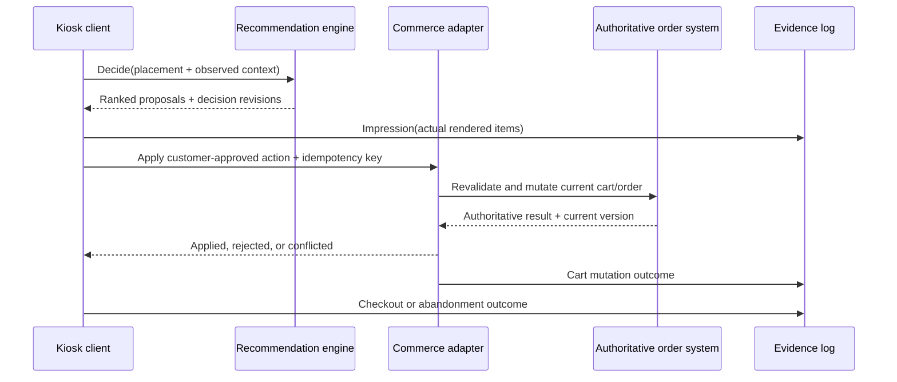

# Public kiosk and order-management recommendation integration patterns

**Research date:** 2026-07-28

**Decision supported:** Define a provider-neutral boundary between a kiosk-shaped client, a recommendation engine, and an authoritative commerce/order adapter.

**Source policy:** Only official API documentation, standards, and source specifications were used. Public products below are evidence for recurring integration patterns, not proposed dependencies.

## Compatibility boundary

This research does **not** establish compatibility with any private KFC kiosk, OMS, POS, catalog, identity, telemetry, or rule contract. Those contracts and access are not present in this repository. It therefore does not assert field parity, authentication compatibility, latency fit, event availability, or permission to mutate a production order.

The public evidence supports a neutral adapter contract. A later private-contract review must map each field and behavior explicitly; an unknown or lossy mapping must remain `unknown` or fail validation rather than be inferred.

## Decision

Use three deliberately separate interfaces:

1. **Recommendation decision:** a side-effect-free request/response. The kiosk supplies a typed placement trigger plus the exact store, catalog, cart, rule, and identity context it observed. The engine returns ranked proposals and the immutable revisions that produced them.
2. **Commerce action:** the kiosk, after the relevant customer action, asks an authoritative commerce adapter to validate and mutate the cart/order. The adapter owns provider authentication, fresh price/availability/modifier checks, optimistic concurrency, and provider-specific idempotency.
3. **Evidence events:** append-only events link request, decision, actual impression, customer action, cart result, checkout, and abandonment. They carry stable event IDs and the decision/configuration revisions needed for attribution and replay.

The recommendation engine never claims that a returned item was shown, accepted, added, priced, or fulfilled. Those facts arrive only through downstream events from the component that observed or executed them.



## What the public interfaces consistently reveal

| Concern | Primary-source observation | Provider-neutral implication |
|---|---|---|
| Placement | Google exposes prediction through a named placement/serving-config resource; one model can be attached to multiple serving configurations, and the request includes the user event that triggered prediction. Supported recommendation surfaces include detail, add-to-cart, shopping-cart, and purchase-complete pages. [Predict API](https://docs.cloud.google.com/retail/docs/reference/rest/v2beta/projects.locations.catalogs.placements/predict), [serving configs](https://docs.cloud.google.com/retail/docs/configs), [models and context products](https://docs.cloud.google.com/retail/docs/models) | Make `placement.key` and `placement.trigger` first-class, versioned fields. Do not infer placement from free text or URL names. A placement selects policy/configuration; it is not merely a display label. |
| Request context | Google requires a `UserEvent` in the prediction request and says a shopping-cart-page-view trigger should include the products currently in the cart. Prediction filters can restrict tags and out-of-stock items. Oracle's public kiosk API exposes location, revenue center, order type/channel, local menu, prices, and availability-related configuration. [Predict API](https://docs.cloud.google.com/retail/docs/reference/rest/v2beta/projects.locations.catalogs.placements/predict), [context products](https://docs.cloud.google.com/retail/docs/models), [Oracle kiosk API](https://docs.oracle.com/en/industries/food-beverage/simphony/sikio/index.html) | Send an observed cart snapshot, store/order context, catalog revision, and explicit constraints. Product IDs alone are insufficient. Context values must be typed and provenance-bearing. |
| Store and catalog identity | A commercetools cart can be bound to a Store, and that Store cannot later be changed. The cart carries line items plus either `customerId` or `anonymousId`; line-item product data is captured when added and is not automatically refreshed. Oracle menu requests are scoped by organization, location, and revenue center and support HTTP validators. [commercetools Carts](https://docs.commercetools.com/api/projects/carts), [Oracle Get a menu](https://docs.oracle.com/en/industries/food-beverage/simphony/omsstsg2api/op-api-v1-menus-menuid-get.html) | Include explicit commerce-environment, store/revenue-center, cart, catalog-snapshot, currency, and fulfillment/order-type identifiers. Treat catalog and cart observations as revisioned snapshots, not timeless truth. |
| Ranked output | Google returns ranked product IDs, optional scores/metadata, missing input IDs, and an attribution token. AWS returns ranked item IDs, optional scores/metadata, and a `recommendationId`. Neither response is a cart-mutation result. [Google PredictResponse](https://docs.cloud.google.com/retail/docs/reference/rest/v2alpha/PredictResponse), [AWS GetRecommendations](https://docs.aws.amazon.com/personalize/latest/dg/API_RS_GetRecommendations.html) | Return proposals plus a `decisionId`; do not return or imply `addedToCart`. Preserve missing/filtered candidate reasons and the configuration/model/rule authority used. |
| Actual impressions | AWS distinguishes returned recommendations from items actually visible to the user. It accepts an explicit `impression` list or derives implicit impressions by linking a later event to `recommendationId`. Google returns an attribution token intended for later user-event logs. [AWS impression events](https://docs.aws.amazon.com/personalize/latest/dg/putevents-including-impressions-data.html), [Google PredictResponse](https://docs.cloud.google.com/retail/docs/reference/rest/v2alpha/PredictResponse) | Log an impression only after the client can attest that an item was rendered/visible. Store item, rank, placement, decision ID, and attribution token. Never equate a decision response with an impression. |
| Outcomes | Google names separate detail-view, add-to-cart, and purchase-complete user events and requires a separate event-write request; the prediction request itself is not ingested as an event. AWS records interactions separately with `PutEvents`, linked by recommendation ID. [Google user events](https://docs.cloud.google.com/retail/docs/user-events), [Google Predict API](https://docs.cloud.google.com/retail/docs/reference/rest/v2beta/projects.locations.catalogs.placements/predict), [AWS event recording](https://docs.aws.amazon.com/personalize/latest/dg/recording-events.html) | Keep outcome ingestion independent of serving. Record observed action and authoritative cart/checkout outcomes, not only clicks. Link them to the decision and impression without making serving depend on analytics availability. |
| Identity | Google warns against using one fixed visitor or user ID for different people. AWS supports session-only anonymous activity, then an explicit session-to-user association; session-only history is not silently treated as a durable customer identity. commercetools separately models `anonymousId` and `customerId`. [Google Predict API](https://docs.cloud.google.com/retail/docs/reference/rest/v2beta/projects.locations.catalogs.placements/predict), [AWS anonymous events](https://docs.aws.amazon.com/personalize/latest/dg/recording-events.html#event-recording-anonymous-users), [commercetools Carts](https://docs.commercetools.com/api/projects/carts) | Require a channel session ID; allow a separately typed, optional authenticated subject. Never substitute a shared kiosk/device ID for a person or infer demographic identity. Identity linkage is an explicit upstream fact. |
| Action authority | Oracle separates kiosk configuration, calculation, payment, and check submission. Its transaction service validates and manages checks using location/revenue-center context. Square order updates require order write permission and the latest order version. [Oracle kiosk API](https://docs.oracle.com/en/industries/food-beverage/simphony/sikio/index.html), [Oracle Checks API](https://docs.oracle.com/en/industries/food-beverage/simphony/omsstsg2api/api-checks-api.html), [Square UpdateOrder](https://developer.squareup.com/reference/square/orders/update-order) | The engine proposes; the kiosk and commerce adapter execute. Only the authoritative commerce boundary may validate prices/modifiers and mutate the cart/order. Recommendation credentials should not grant order-write authority. |
| Concurrency | commercetools requires the expected resource `version` on versioned updates and rejects a mismatch. Square requires the latest order version so one application does not overwrite another's change. [commercetools resource versioning](https://docs.commercetools.com/api/general-concepts#resource-versioning), [Square order updates](https://developer.squareup.com/docs/orders-api/manage-orders/update-orders) | Bind the decision to the observed cart version. Before applying a recommendation, re-read or validate the current version. A mismatch is a conflict requiring re-evaluation, not a blind retry. |
| Idempotency | Square uses a unique idempotency key so a retry of the same mutation does not repeat the effect. Oracle duplicate-request detection uses an integrator-generated ID, but documents a 300-second retention window and single-workstation scope. CloudEvents defines duplicate detection through unique `source` + `id`. [Square idempotency](https://developer.squareup.com/docs/build-basics/common-api-patterns/idempotency), [Oracle duplicate requests](https://docs.oracle.com/en/industries/food-beverage/simphony/omsstsg2api/detect_dup_requests.html), [CloudEvents specification](https://github.com/cloudevents/spec/blob/main/cloudevents/spec.md) | Use distinct IDs for decision deduplication, event deduplication, and commerce mutations. Document scope and retention per adapter; never assume a provider's key is global or permanent. Couple mutation idempotency with cart/order version checks. |
| Rule/config versioning | Google serving configurations associate a model and serving options with a named serving resource and allow models/controls to be swapped. commercetools versions resources and exposes change history. CloudEvents says incompatible data-schema changes should use a different `dataschema` URI. [Google serving configs](https://docs.cloud.google.com/retail/docs/configs), [commercetools resource versioning](https://docs.commercetools.com/api/general-concepts#resource-versioning), [CloudEvents primer](https://github.com/cloudevents/spec/blob/main/cloudevents/primer.md#versioning-of-cloudevents) | Import OMS rules as immutable snapshots with provider revision or canonical hash, effective range, scope, and schema URI. Record the exact rule, eligibility-policy, serving-config, and model revisions on every decision and event. |
| Failure reporting | RFC 9457 defines machine-readable HTTP problem details. Google event writes can be asynchronous but explicitly warn that silent failures may occur. Oracle returns problem details for transactional errors, and both Oracle and Square expose the possibility that a timed-out/failed response needs reconciliation rather than assuming no effect. [RFC 9457](https://www.rfc-editor.org/rfc/rfc9457.html), [Google event write](https://docs.cloud.google.com/retail/docs/reference/rest/v2/projects.locations.catalogs.userEvents/write), [Oracle duplicate requests](https://docs.oracle.com/en/industries/food-beverage/simphony/omsstsg2api/detect_dup_requests.html), [commercetools update guarantees](https://docs.commercetools.com/api/general-concepts#update-guarantees) | Use typed problem responses and classify retryability. Serving failure must not mutate or block the order path. Ambiguous commerce timeouts require idempotent reconciliation against authoritative state; they are not safe to report as failed mutations without checking. |
| Correlation | W3C Trace Context standardizes `traceparent` and `tracestate` across services. CloudEvents provides transport-neutral event identity, type, source, subject, schema, and time. [W3C Trace Context](https://www.w3.org/TR/trace-context/), [CloudEvents specification](https://github.com/cloudevents/spec/blob/main/cloudevents/spec.md) | Propagate trace context separately from durable business IDs. Use business IDs for replay/audit and trace IDs for operational correlation; neither replaces the other. |

## Recommended neutral contract

The names below are proposal-level semantics, not a claim that a provider exposes the same fields.

### Decision request

```json
{
  "schema": "urn:recommendation:decision-request:v1",
  "requestId": "01J...",
  "requestedAt": "2026-07-28T10:15:00Z",
  "placement": {
    "key": "smart-cross-sell",
    "trigger": "cart-view",
    "maxResults": 3
  },
  "commerce": {
    "environmentRef": "adapter-defined",
    "storeRef": "store-42",
    "revenueCenterRef": "optional-adapter-defined",
    "channel": "kiosk",
    "fulfillmentType": "take-away",
    "currency": "VND"
  },
  "identity": {
    "sessionRef": "ephemeral-session",
    "subjectRef": null,
    "deviceRef": "operational-device-ref"
  },
  "cart": {
    "cartRef": "cart-123",
    "version": "17",
    "lines": [
      {
        "lineRef": "line-1",
        "productRef": "product-9",
        "quantity": 1,
        "modifierRefs": ["modifier-4"]
      }
    ]
  },
  "catalog": {
    "snapshotRef": "catalog-observation-abc",
    "revision": "etag-or-canonical-hash"
  },
  "rules": {
    "snapshotRef": "oms-rule-snapshot-2026-07-28-a",
    "revision": "provider-revision-or-canonical-hash"
  },
  "constraints": {
    "eligibleProductRefs": ["product-10", "product-11"],
    "excludedProductRefs": [],
    "priceCeilingMinor": null
  },
  "trace": {
    "traceparent": "00-..."
  }
}
```

Contract rules:

- `requestId` deduplicates one logical decision request. Reuse is valid only for an identical canonical request body; a different body with the same ID is a conflict.
- `placement.key` is a controlled identifier and `trigger` is a controlled event type.
- `sessionRef`, `subjectRef`, and `deviceRef` are distinct namespaces. Only `subjectRef` can represent an authenticated customer.
- `cart.version`, `catalog.revision`, and `rules.revision` describe what the engine saw. They do not authorize a later mutation.
- Candidate eligibility should normally be calculated from an authoritative adapter snapshot. If the engine receives an explicit eligible set, its provenance and revision must be retained.
- Money uses integer minor units plus an explicit currency. Provider prices are revalidated at action time.
- Do not send unnecessary personal data, raw payment data, access tokens, or unrestricted customer history.

### Decision response

```json
{
  "schema": "urn:recommendation:decision-response:v1",
  "decisionId": "01J...",
  "requestId": "01J...",
  "placement": {
    "key": "smart-cross-sell",
    "trigger": "cart-view"
  },
  "observed": {
    "cartVersion": "17",
    "catalogRevision": "etag-or-canonical-hash",
    "ruleRevision": "provider-revision-or-canonical-hash"
  },
  "authority": {
    "mode": "hybrid",
    "eligibilityPolicyRevision": "policy-sha256",
    "ruleSnapshotRef": "oms-rule-snapshot-2026-07-28-a",
    "ruleRevision": "provider-revision-or-canonical-hash",
    "servingConfigRevision": "serving-config-sha256",
    "modelRelease": "model-name@immutable-version"
  },
  "proposals": [
    {
      "productRef": "product-10",
      "rank": 1,
      "score": 0.71,
      "reasonCodes": ["basket-affinity"],
      "appliedRuleRefs": ["rule-7"]
    }
  ],
  "suppressed": [],
  "expiresAt": "2026-07-28T10:15:30Z",
  "fallback": null
}
```

Contract rules:

- `proposals` are suggestions, not commerce actions.
- Every decision pins immutable authority. Historical evidence is never reinterpreted using today's rules or model.
- `suppressed` should carry machine-readable reasons such as `ineligible`, `out_of_stock`, `rule_excluded`, `missing_catalog_mapping`, or `stale_context`, without leaking sensitive internals.
- `expiresAt` is an engine freshness bound. It is not a promise of store availability.
- A valid empty result is distinct from a technical failure.
- Do not expose a score as a calibrated probability unless the model release contract says it is one.

### Evidence event envelope

Use a CloudEvents-compatible envelope or preserve the same semantics:

```json
{
  "specversion": "1.0",
  "id": "01J...",
  "source": "urn:kiosk:device-class:channel-instance",
  "type": "com.example.recommendation.impression.v1",
  "subject": "decision/01J...",
  "time": "2026-07-28T10:15:01Z",
  "dataschema": "urn:recommendation:event:impression:v1",
  "datacontenttype": "application/json",
  "data": {
    "decisionId": "01J...",
    "requestId": "01J...",
    "placementKey": "smart-cross-sell",
    "sessionRef": "ephemeral-session",
    "cartRef": "cart-123",
    "cartVersionObserved": "17",
    "catalogRevision": "etag-or-canonical-hash",
    "ruleRevision": "provider-revision-or-canonical-hash",
    "modelRelease": "model-name@immutable-version",
    "items": [
      {"productRef": "product-10", "rank": 1}
    ],
    "providerAttribution": {
      "token": "opaque-if-present"
    }
  }
}
```

Minimum event types:

| Event | Producer and truth represented |
|---|---|
| `recommendation.decision-created.v1` | Engine: proposals were computed under the recorded authority revisions. |
| `recommendation.impression.v1` | Client: these proposal items were actually rendered/visible in this placement and rank order. |
| `recommendation.action-selected.v1` | Client: the customer selected a recommendation action. This is not yet a successful cart mutation. |
| `commerce.cart-mutation.v1` | Commerce adapter: the authoritative mutation was applied, rejected, conflicted, timed out, or reconciled. Include the provider's resulting cart version when available. |
| `commerce.checkout-completed.v1` | Order/commerce adapter: checkout completed for the authoritative order, with allowed aggregate value fields. |
| `commerce.session-abandoned.v1` | Session owner: the defined abandonment boundary was reached without checkout. |

Event rules:

- `(source, id)` is the event deduplication key. Consumers must be idempotent.
- Record occurrence time and ingestion time separately.
- Preserve item rank and the exact displayed subset. A decision with three proposals can produce an impression with one, two, three, or zero items.
- Preserve negative and non-action outcomes; do not train unshown items as rejects.
- Attribution tokens are opaque, provider-scoped values. Store and forward them only under the provider's documented rules.
- Late events are accepted within a declared window and retain their original occurrence time.

## Immutable OMS rule snapshot

Until an actual rule API and schema are available, the adapter-facing representation should be an immutable snapshot:

```json
{
  "schema": "urn:recommendation:rule-snapshot:v1",
  "snapshotRef": "oms-rule-snapshot-2026-07-28-a",
  "source": {
    "provider": "unbound",
    "environmentRef": "unbound",
    "providerRevision": null,
    "retrievedAt": "2026-07-28T09:00:00Z",
    "canonicalSha256": "..."
  },
  "effective": {
    "from": "2026-07-28T00:00:00Z",
    "until": null
  },
  "scope": {
    "storeRefs": ["store-42"],
    "placementKeys": ["smart-cross-sell"],
    "channel": "kiosk"
  },
  "rules": [
    {
      "ruleRef": "rule-7",
      "priority": 100,
      "enabled": true,
      "condition": {},
      "effect": {
        "kind": "exclude",
        "productRefs": ["product-99"]
      }
    }
  ]
}
```

Required governance:

- Preserve the raw provider payload separately from the normalized snapshot.
- Record provider revision/validators when available and a canonical hash regardless.
- Version the schema URI on incompatible changes.
- Give rules stable IDs, explicit priority, effective dates, placement/channel/store scope, and controlled effect types.
- Reject unknown condition/effect types and missing catalog mappings. Do not silently discard unsupported semantics.
- Record both matched rules and the final authority path on the decision.
- Publish a new immutable snapshot for change or rollback; never edit a snapshot already referenced by a decision.
- Keep emergency deterministic exclusions and eligibility checks authoritative over ranking.

This is a normalization proposal. Public APIs demonstrate named/versioned resources and scoped commerce context, but they do not prove the private OMS uses these rule fields.

## Action and mutation protocol

1. The client renders a proposal and records the actual impression.
2. A customer selection creates a new `actionId` and `mutationId`; it does not reuse the decision or event ID.
3. The commerce adapter obtains or validates current cart/order state.
4. It checks:
   - cart/order version;
   - store/revenue-center and order channel/type;
   - product and modifier mapping;
   - current availability;
   - current price, tax, discount, and promotion rules;
   - quantity and compatibility constraints;
   - customer authorization/confirmation required by the channel.
5. It performs one provider mutation with the provider-scoped idempotency mechanism.
6. On a version conflict, it returns `conflicted` with current context and requests a new decision when appropriate.
7. On an ambiguous timeout, it retries/reconciles with the same provider idempotency key and reads authoritative state before reporting a final result.
8. It emits the mutation outcome independent of the recommendation request path.

The engine must not receive order-write credentials. If a deployment combines components, the logical permission boundary still applies: prediction/event-write/order-write scopes remain distinct.

## Failure isolation and fallback

| Failure | Required behavior |
|---|---|
| Recommendation timeout/unavailable | Continue the base ordering journey with no recommendation, or a separately governed deterministic fallback. Never block cart review, payment, or checkout. |
| Valid empty recommendation | Render nothing for the placement and record the decision as valid-empty if evidence is required. Do not treat it as an outage. |
| Stale cart/catalog/rules | Do not apply the stale proposal. Refresh context and request a new decision, or continue without a recommendation. |
| Unknown product/rule mapping | Exclude or reject with a typed reason. Never guess an identifier mapping. |
| Impression/event sink unavailable | Buffer to a bounded durable outbox with stable event IDs, or drop under an explicit loss policy. Do not fail the commerce action because analytics is unavailable. |
| Commerce validation rejection | Show the provider-safe reason, refresh the cart, and emit the rejection. Do not report acceptance or silently substitute another item. |
| Commerce version conflict | Re-read authoritative state. A blind retry with a new version can apply an action the customer did not approve. |
| Ambiguous mutation response | Reconcile using the same mutation idempotency key and authoritative read. Do not assume either success or failure. |
| Invalid request | Return an RFC 9457 problem response with a stable type, appropriate HTTP status, occurrence instance/correlation, and machine-readable extensions. |
| Trace/telemetry failure | Preserve business IDs and continue within the relevant functional policy. Tracing must not become an ordering dependency. |

Define separate latency budgets for decision serving, commerce validation/mutation, and asynchronous evidence delivery. A public API's documented behavior is not evidence for a private production SLA.

## Contract invariants for implementation and tests

1. One canonical decision request ID maps to one canonical request body and one response.
2. A decision cannot create or modify a cart/order.
3. A decision records cart, catalog, rule, eligibility-policy, serving-config, and model revisions.
4. An impression can reference only proposal items from its decision and records the displayed subset and rank.
5. A selected action is not a successful mutation.
6. A successful mutation is emitted only by the commerce authority and includes the resulting authoritative version when available.
7. Mutation retries reuse the same provider-scoped idempotency key; event retries reuse the same `(source, id)`.
8. A cart/order version mismatch cannot be silently overwritten.
9. Anonymous session, authenticated subject, and device identifiers are never conflated.
10. Unknown mappings, unsupported rule semantics, stale context, and missing authority revisions fail validation.
11. Recommendation, evidence, and tracing failures cannot corrupt or duplicate a commerce mutation.
12. Historical evidence remains attributable to the immutable authority revisions that produced it.

## Private-contract questions that remain open

These cannot be answered from public documentation:

- Which placement triggers and presentation lifecycle events the target kiosk actually exposes.
- Whether “visible” can be measured reliably and how kiosk navigation affects impression semantics.
- The private session, device, customer, cart, order, store, revenue-center, product, modifier, and promotion identifier namespaces.
- The real OMS rule schema, types, priority semantics, effective dating, scoping, revision/rollback mechanism, and export/API availability.
- Which system is authoritative for store availability, price, tax, discount, modifier compatibility, and cart mutation.
- Provider idempotency key scope, retention, request-body equality behavior, and reconciliation endpoints.
- Authentication scopes and whether separate prediction, telemetry, catalog-read, and order-write credentials are possible.
- Latency budgets, retry policies, outage behavior, offline mode, and kiosk queueing constraints.
- Event retention, consent, privacy, deletion, and permitted training joins.
- Whether checkout, abandonment, refund, cancellation, fulfillment, and order-status outcomes are available and linkable to decisions.

Production compatibility requires an anonymized private schema/export or sandbox plus end-to-end contract tests. Until then, the adapter remains provider-neutral and mock-backed.

## Primary sources

- Google Cloud Retail: [Predict API](https://docs.cloud.google.com/retail/docs/reference/rest/v2beta/projects.locations.catalogs.placements/predict), [PredictResponse](https://docs.cloud.google.com/retail/docs/reference/rest/v2alpha/PredictResponse), [serving configurations](https://docs.cloud.google.com/retail/docs/configs), [recommendation models and context products](https://docs.cloud.google.com/retail/docs/models), [user events](https://docs.cloud.google.com/retail/docs/user-events), [write user event](https://docs.cloud.google.com/retail/docs/reference/rest/v2/projects.locations.catalogs.userEvents/write).
- Amazon Personalize: [GetRecommendations](https://docs.aws.amazon.com/personalize/latest/dg/API_RS_GetRecommendations.html), [recording events and anonymous identity](https://docs.aws.amazon.com/personalize/latest/dg/recording-events.html), [impression events](https://docs.aws.amazon.com/personalize/latest/dg/putevents-including-impressions-data.html).
- Oracle Simphony: [Kiosk JavaScript API](https://docs.oracle.com/en/industries/food-beverage/simphony/sikio/index.html), [Transaction Services introduction](https://docs.oracle.com/en/industries/food-beverage/simphony/omsstsg2api/introduction.html), [Checks API](https://docs.oracle.com/en/industries/food-beverage/simphony/omsstsg2api/api-checks-api.html), [Get a menu](https://docs.oracle.com/en/industries/food-beverage/simphony/omsstsg2api/op-api-v1-menus-menuid-get.html), [duplicate request detection](https://docs.oracle.com/en/industries/food-beverage/simphony/omsstsg2api/detect_dup_requests.html).
- commercetools: [Carts](https://docs.commercetools.com/api/projects/carts), [resource updates, versioning, concurrency, and update guarantees](https://docs.commercetools.com/api/general-concepts).
- Square: [UpdateOrder](https://developer.squareup.com/reference/square/orders/update-order), [order update concurrency](https://developer.squareup.com/docs/orders-api/manage-orders/update-orders), [idempotency](https://developer.squareup.com/docs/build-basics/common-api-patterns/idempotency).
- Standards and specifications: [CloudEvents 1.0 specification](https://github.com/cloudevents/spec/blob/main/cloudevents/spec.md), [CloudEvents primer](https://github.com/cloudevents/spec/blob/main/cloudevents/primer.md), [W3C Trace Context](https://www.w3.org/TR/trace-context/), [RFC 9457 Problem Details for HTTP APIs](https://www.rfc-editor.org/rfc/rfc9457.html).
