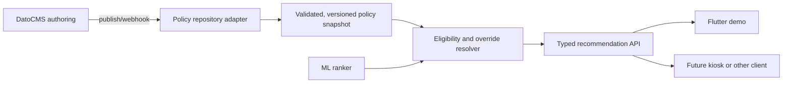

# CMS options for recommendation merchandising policies

**Research date:** 2026-07-24

**Decision supported:** Choose a channel-neutral control plane for product-team recommendation overrides in the KFC product-recommendation POC.

**Source policy:** Only official vendor pricing, documentation, source, and license pages were used.

## Recommendation

Use **DatoCMS Free** for this POC, behind a provider-neutral policy repository in the recommendation service.

DatoCMS is the strongest current fit because its free managed plan is intended for testing and prototyping and includes the Professional feature set at lower resource limits. It provides structured models, validation, scheduled publish/unpublish, record versioning and rollback, webhooks, a GraphQL delivery API, and a REST management API without requiring the team to deploy a CMS service. The current free limits—300 records, 100,000 delivery API calls/month, 25,000 management API calls/month, 10 GB/month bandwidth, and three days of record history—are ample for a small policy corpus. Free projects are hard-stopped when a limit is reached, so this recommendation is explicitly for the POC, not a production kiosk SLA. Sources: [DatoCMS pricing](https://www.datocms.com/pricing), [Free-plan limits and deactivation behavior](https://www.datocms.com/docs/plans-pricing-and-billing/free-developer-plan-limits-and-deactivations), [record versioning](https://www.datocms.com/docs/general-concepts/versioning), [scheduled publishing](https://www.datocms.com/docs/general-concepts/scheduled-publishing-unpublishing), and [webhooks](https://www.datocms.com/docs/general-concepts/webhooks).

Use **Sanity Growth** instead if schema-as-code, GROQ, real-time editing, or a larger collaborating editor team is more valuable than keeping the POC free. Sanity Free is a viable second choice for non-sensitive POC policies, but its datasets are public-only, its available roles are Administrator and Viewer, and scheduled drafts require Growth. Growth is currently $15 per seat/month. Sources: [Sanity pricing](https://www.sanity.io/pricing), [schema types](https://www.sanity.io/docs/apis-and-sdks/schema-types), [roles](https://www.sanity.io/docs/user-guides/roles), and [history retention](https://www.sanity.io/docs/user-guides/history-experience).

Do not build or couple to a Flutter CMS. The CMS is an authoring control plane consumed by the recommendation backend; the Flutter app is only one possible POC presentation client.

## What the CMS must control

The CMS does not implement ranking. It authors versioned merchandising policy that can override or influence the recommendation service:

```text
RecommendationPolicy
  id
  name
  action: replace | pin | boost | exclude
  placement:
    local_favorite | modifier_upsell | smart_cross_sell | single_upsell
  productIds[]
  modifierIds[]
  storeIds[]
  startsAt
  endsAt
  campaignId?
  priority
  boostWeight?
  enabled
  reasonCode
  revision
```

All candidates can represent this schema. The important architectural rule is that CMS publication and policy applicability are separate:

- CMS draft/publish controls whether a policy is available to the recommendation service.
- `startsAt` and `endsAt` control whether the published policy applies to the current request.
- `priority` and deterministic conflict rules resolve overlapping policies.
- Product and modifier availability remain hard validity checks. A CMS `replace` override cannot make an invalid or unavailable target valid.
- The recommendation service fetches and validates a policy snapshot, caches it, and exposes its own typed recommendation API. Kiosk, mobile, web, chat, and the Flutter demo do not call the CMS directly.

This preserves the option to replace the CMS without changing model inference or client contracts.

## Comparison

| Option | Managed cost and free constraints | Self-hosted cost/license | Structured modeling | Scheduling | History, audit, roles | APIs and change events | Operations burden | Fit |
|---|---|---|---|---|---|---|---|---|
| **DatoCMS** | Free managed tier: 300 records, 100k delivery API calls/month, 25k management calls/month, 10 GB traffic, hard stops on overage. Professional starts at €149/month billed annually or €199 monthly. The pricing summary says two editors, while its detailed limits table says one collaborator; safely assume one until verified in-account. | No general self-hosted product. | Visual structured models, references, validation, and up to 100 models on Free. | Scheduled publish/unpublish is part of the Professional feature set exposed on Free at lower resource limits. | Version/rollback included; three-day Free history. Project roles are available, but Enterprise is required for audit logs and the most advanced governance. | GraphQL delivery, REST management, preview/real-time APIs, webhooks. | **Very low.** Vendor manages data and APIs. | **Best POC fit.** Free, private token-based APIs, capable editorial controls, no CMS deployment. |
| **Sanity** | Free: $0, up to 20 seats, two public-only datasets, 10k documents, two GROQ webhooks, 250k API calls/month, and hard caps. Growth: $15/seat/month, private datasets and scheduled drafts. | Sanity Studio can be hosted, but Content Lake is the managed data service; not a like-for-like self-hosted backend. | Strong schema-as-code model, references, validation, and GROQ queries. | Scheduled drafts are Growth; Content Releases are not part of Free/Growth standard inclusions. Policy `startsAt`/`endsAt` can still be evaluated by the backend on Free. | History: three days Free, 90 days Growth. Free exposes Administrator/Viewer roles; Growth adds Editor, Developer, and Contributor; custom roles are Enterprise. | Content Lake APIs, GROQ, GraphQL, document/transaction webhooks. | **Low.** Studio configuration/deployment plus managed data service. | Strong runner-up. Free public data and coarse roles are the main POC drawbacks. |
| **Directus** | Core software tier: $0 with three seats, 25 collections, five flows, and 30-day activity/revision retention. First-party Cloud is now a $99/month add-on. Team is $499/month annually or $599 month-to-month. An official grant can make self-hosting free for qualifying organizations. | Self-hosted Core is free within its current seat/collection/flow limits and grant/license terms. | Excellent relational schema editor over SQL, relationships, validation, and business-friendly Data Studio. | Scheduled Flow triggers support cron; the policy's own validity window remains preferable for request-time applicability. | Advanced RBAC is listed in Core; 30-day activity log and revisions. | REST, GraphQL, SDK, event/webhook/scheduled Flows. | **Medium.** Database, Directus runtime, backups, upgrades, and security must be operated when self-hosted. | Best self-hosted GUI option, but no longer a low-cost managed choice. |
| **Payload** | New first-party Payload Cloud deployments are currently paused following its acquisition by Figma; existing Cloud projects continue. | Completely free, open-source, MIT-licensed, self-hosted. Runs as a Next.js app and requires a supported database; production may also require job workers and durable storage. | Strong TypeScript schema-as-code with fields, validation, relationships, generated admin UI, and migrations. | Built-in scheduled publish/unpublish through drafts and jobs. | Built-in versions, diffs, restoration, drafts, and programmable field/document/operation access control. | Generated REST, GraphQL, and Local APIs; lifecycle hooks and jobs. | **High for this POC.** Separate Next.js runtime, database, migrations, backups, and scheduled jobs. | Technically excellent, but disproportionate operational work while managed onboarding is paused. |
| **Strapi** | Current Strapi Cloud starts at $35/project/month. Cloud pays for hosting only. CMS Growth is a separate $45/month license for three seats, releases, and 30-day Content History. | Community is free and MIT-licensed with unlimited entries/API calls at the software layer. | Visual Content-Type Builder, components, dynamic zones, validation, and extensibility. | Releases require CMS Growth. Cron is available in the platform; request-time validity fields still belong in the policy. | Community includes RBAC and draft/publish. Growth adds Content History. Review Workflows and Audit Logs are Enterprise. | REST, GraphQL, API tokens, webhooks, lifecycle customization. | **Medium-high.** Node service, database, deployment, backups, and upgrades when self-hosted. | Capable but heavier and more expensive than DatoCMS for this POC. |

## Vendor notes and evidence

### DatoCMS

- The official pricing page says Free is free forever and provides 300 records, 100,000 delivery calls/month, 25,000 management calls/month, 10 GB/month traffic, three projects, and three days of history. It also says the Free plan exposes Professional functionality with lower limits. [Pricing](https://www.datocms.com/pricing)
- DatoCMS explicitly describes Free as primarily for testing and prototyping. Hitting a Free monthly limit suspends the admin UI, APIs, and asset CDN until the next month unless upgraded. [Free-plan limits](https://www.datocms.com/docs/plans-pricing-and-billing/free-developer-plan-limits-and-deactivations)
- Record versioning creates a snapshot on save, supports comparison/restoration, and retains Free history for three days. [Record versioning](https://www.datocms.com/docs/general-concepts/versioning)
- Scheduled publishing and unpublishing are built-in. [Scheduled publishing](https://www.datocms.com/docs/general-concepts/scheduled-publishing-unpublishing)
- Webhooks can notify the recommendation service to refresh its validated policy snapshot. [Webhooks](https://www.datocms.com/docs/general-concepts/webhooks)
- The product exposes GraphQL delivery and REST management APIs, keeping it independent of any Flutter, web, or kiosk client. [Pricing feature matrix](https://www.datocms.com/pricing)
- Pricing has an internal seat-count inconsistency: the summary advertises two editors, while the detailed collaborator row lists one. The design must not depend on a second free editor until the account confirms it.

### Sanity

- Free currently provides up to 20 seats, two public-only datasets, 10,000 documents, two GROQ-powered webhooks, 250,000 API calls/month, and one million CDN calls/month. Only Administrator and Viewer roles are included. Growth is $15 per seat/month and adds private datasets, five roles, and scheduled drafts. [Pricing](https://www.sanity.io/pricing)
- Sanity schemas define typed documents and fields, including objects, arrays, numbers, strings, and references. [Schema reference](https://www.sanity.io/docs/apis-and-sdks/schema-types)
- Document webhooks support GROQ filtering and customized payloads. [Webhook API](https://www.sanity.io/docs/http-reference/webhooks)
- History retention is three days on Free and 90 days on Growth. [History experience](https://www.sanity.io/docs/user-guides/history-experience)

### Directus

- Current official pricing lists Core at $0 with three seats, 25 collections, five flows, and 30-day activity/revision retention. Self-hosting is available; Directus Cloud is an optional $99/month add-on for Core and Team. [Pricing](https://directus.com/pricing)
- Directus supplies a no-code relational data-model editor over SQL and generates APIs and a business-user Data Studio. [Data model](https://docs.directus.io/app/data-model)
- Flows support `event`, `webhook`, `operation`, `schedule`, and `manual` triggers. [Flows API](https://docs.directus.io/reference/system/flows)
- Revisions record data snapshots and deltas; the activity log records data-changing actions that pass through Directus. [Revisions](https://docs.directus.io/reference/system/revisions) and [Activity Log](https://docs.directus.io/user-guide/settings/activity-log)

### Payload

- Payload states that new Cloud deployments are paused and that new projects should self-host anywhere a Next.js app can run. [Current Payload Cloud status](https://payloadcms.com/payload-has-joined-figma)
- Payload is completely free and open source under MIT. [Open-source announcement](https://payloadcms.com/posts/blog/open-source)
- Fields define both stored schema and generated admin UI; Payload exposes REST and GraphQL APIs. [Fields](https://payloadcms.com/docs/fields/overview), [REST](https://payloadcms.com/docs/rest-api/overview), and [GraphQL](https://payloadcms.com/docs/graphql/overview)
- Versions provide history, diffs, restoration, and user attribution. Drafts support scheduled publish/unpublish. [Versions](https://payloadcms.com/docs/versions/overview) and [Drafts](https://payloadcms.com/docs/versions/drafts)
- Self-hosted production requires the app runtime plus a supported Postgres or MongoDB database, and possibly permanent file storage and a worker for scheduled jobs. [Production deployment](https://payloadcms.com/docs/production/deployment)

### Strapi

- Community is free and MIT-licensed with RBAC, REST/GraphQL, webhooks, draft/publish, and unlimited software-level usage. CMS Growth is $45/month for three seats and adds Releases and 30-day Content History. Review Workflows and Audit Logs are Enterprise. [CMS pricing](https://strapi.io/pricing-cms)
- Current Cloud starts at $35/project/month for 100,000 API calls and sleeps when idle. Pro is $90/month and adds weekly backups and cron jobs. [Cloud pricing](https://strapi.io/pricing-cloud)
- Strapi states that Cloud hosting and paid CMS features are billed separately. [Cloud usage and billing](https://support.strapi.io/articles/3581379360-understanding-strapi-cloud-usage-and-billing)
- The current Cloud pricing page is authoritative over an older official blog that advertised a permanent free Cloud plan; that free plan is no longer listed.

## Integration contract for the POC



Recommended service boundary:

1. Define an app-owned typed `RecommendationPolicy` contract and validation rules.
2. Implement a DatoCMS adapter that maps external records into that contract immediately.
3. Refresh a cached snapshot on startup, on a signed webhook, and periodically as a safety net.
4. Keep the last valid snapshot if the CMS is unavailable or returns invalid records.
5. Record the policy snapshot version and winning policy ID in recommendation telemetry.
6. Resolve policy actions in this order:
   - hard product/modifier validity and safety checks;
   - applicable `replace` override;
   - ML ranking;
   - `pin`, `boost`, and `exclude` policy application;
   - diversity and response-shape rules.
7. Evaluate `startsAt`/`endsAt`, store, placement, and campaign scope in the recommendation service even if CMS scheduling is used.

## POC-to-production re-evaluation triggers

Revisit the CMS decision before production if any of these becomes true:

- more than 300 policies/related records are required;
- more than the confirmed Free collaborator count needs access;
- three days of history is insufficient;
- uninterrupted policy delivery becomes an SLA;
- audit logs, SSO, approval workflows, or fine-grained enterprise governance become mandatory;
- campaigns are managed in an existing KFC CMS that should become the source of truth;
- CMS egress must remain inside KFC infrastructure.

At that point, compare DatoCMS Professional/Enterprise, Sanity Growth/Enterprise, and self-hosted Directus against the actual KFC security, procurement, authorship, and uptime requirements. Do not assume the POC choice is the production choice.
