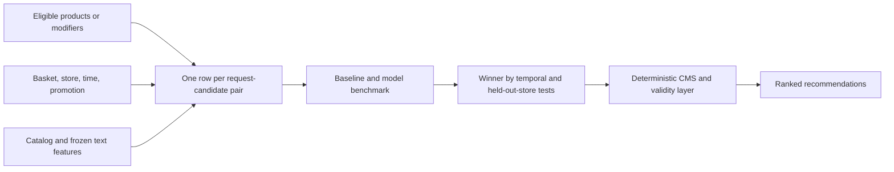

# Recommender model and framework options

**Research date:** 2026-07-24

**Decision supported:** Choose the model families and maintained frameworks to benchmark for the KFC product-recommendation POC.

**Final status:** This options research was followed by the accepted evaluation
contract and empirical qualification. The canonical implementation choices now
live in
[`implementation-ready-specification.md`](../implementation-ready-specification.md).
The executed neural challenger is native Keras 3; the serving choices remain the
qualified deterministic baselines.

**POC facts used for this decision:**

- roughly 120 products, so every eligible candidate can be scored;
- no stable customer identity;
- synthetic transactions and recommendation impressions initially;
- separate smart cross-sell, modifier-upsell, and contextual local-favorite behavior;
- CMS-authored single upsell and CMS override remain outside model selection;
- catalog text embeddings are an optional cold-start feature;
- a contextual bandit is simulated only, not presented as live uplift evidence.

**Source policy:** Only official documentation, source repositories, model cards, and papers were used.

## Recommendation

Use a **common candidate-feature table and evaluation harness**, then benchmark:

1. deterministic contextual-popularity and basket-association baselines;
2. `XGBRanker(objective="rank:ndcg")` as the primary learned baseline;
3. LightGBM `LGBMRanker(objective="lambdarank")` as the direct tree challenger;
4. a compact native Keras 3 context-and-candidate scorer as the neural challenger;
5. frozen `intfloat/multilingual-e5-small` catalog embeddings as an ablation, not as the recommender;
6. Vowpal Wabbit `--cb_explore_adf` in a separate simulated contextual-bandit experiment.

Do **not** build candidate retrieval or approximate nearest-neighbor
infrastructure. This POC has only about 120 catalog products and fewer eligible
modifiers, so complete scoring is both simpler and exact.

The provisional implementation favorite is **XGBoost**, not because it is guaranteed to win, but because its maintained learning-to-rank implementation exposes grouped LambdaMART training, NDCG objectives, deterministic GPU computation, pair-construction controls, and an explicit position-debiasing option for click/impression data. The benchmark, not preference, chooses the final POC model. [XGBoost learning-to-rank guide](https://xgboost.readthedocs.io/en/stable/tutorials/learning_to_rank.html)



## Why this is not “feed everything to a Hugging Face model”

Hugging Face hosts model artifacts; it does not supply KFC purchasing behavior. A generic language or embedding model has not observed the POC's baskets, store effects, promotion response, prices, modifier graph, impressions, or accept/reject outcomes.

`multilingual-e5-small` is useful for one narrow job: convert Vietnamese/English product titles and descriptions into reusable catalog features. Its official model card identifies a 0.1B-parameter, 384-dimensional multilingual model under MIT, and requires the trained `query:` / `passage:` prefixes. [Official model card](https://huggingface.co/intfloat/multilingual-e5-small), [official E5 repository](https://github.com/microsoft/unilm/tree/master/e5), [multilingual E5 paper](https://arxiv.org/abs/2402.05672)

The behavioral ranker must still learn from POC-specific request-candidate examples. Text embeddings should be tested by ablation:

- **without text:** identifiers, categories, price, basket affinity, store/time, promotion, and modifier features;
- **with frozen text:** basket-to-candidate cosine similarity, category-centroid similarity, and optionally a compact learned projection of the 384-dimensional embedding;
- **cold-product test:** products withheld from training interactions but present through catalog attributes.

Do not fine-tune a transformer on synthetic baskets initially. With only about 120 products, that adds variance and makes it harder to tell whether improvement came from behavioral structure or synthetic-text artifacts.

## Framework comparison

| Option | Relevant capability | Current maintenance and license | Fit for this POC | Decision |
|---|---|---|---|---|
| **XGBoost `XGBRanker`** | Grouped LambdaMART with `rank:ndcg`, `rank:map`, and `rank:pairwise`; supports graded relevance, position-debiased LambdaMART, top-k pair construction, and relevance-score output. | Active; upstream release history shows v3.3.0 on 2026-06-17. Apache-2.0. [Repository/releases](https://github.com/dmlc/xgboost/releases), [license](https://github.com/dmlc/xgboost#license) | Excellent fit for mixed tabular, categorical, price, affinity, and compact embedding-derived features. Query groups map naturally to recommendation requests. | **Primary learned baseline.** |
| **LightGBM `LGBMRanker`** | `lambdarank` and `rank_xendcg`; query-group input; NDCG-at-k evaluation; native categorical-feature handling. | Active; upstream release history shows v4.7.0 on 2026-07-18. MIT. [Repository/releases](https://github.com/lightgbm-org/LightGBM/releases), [license](https://github.com/lightgbm-org/LightGBM/blob/master/LICENSE) | Equally plausible tree ranker and may be faster or more accurate on this dataset. Its API accepts group sizes and `eval_at`. [LGBMRanker API](https://lightgbm.readthedocs.io/en/latest/pythonapi/lightgbm.LGBMRanker.html), [ranking parameters](https://lightgbm.readthedocs.io/en/stable/Parameters.html) | **Required tree challenger.** |
| **Native Keras 3** | Functional models, categorical embeddings, numerical features, weighted binary objectives, calibration-ready predictions, and `.keras` serialization. [Keras 3](https://keras.io/keras_3/), [training API](https://keras.io/api/models/model_training_apis/), [model saving](https://keras.io/api/models/model_saving_apis/model_saving_and_loading/) | Maintained directly as Keras 3 without an additional recommendation framework or compatibility runtime. | Suitable for the compact context-plus-candidate scorer used by this POC. Retrieval/two-tower indexing is unnecessary at 120 products. | **Required neural challenger.** |
| **RecBole** | Broad offline research suite with general, sequential, context-aware, and knowledge-based algorithms plus standardized evaluation. [Repository](https://github.com/RUCAIBox/RecBole), [model guide](https://recbole.io/docs/user_guide/model_intro.html) | Latest release v1.2.1 is from 2025-02-23. The LICENSE file is MIT, but the README also states that its data and code may only be used for academic purposes; that inconsistency requires clarification before commercial reuse. [Releases](https://github.com/RUCAIBox/RecBole/releases), [license file](https://github.com/RUCAIBox/RecBole/blob/master/LICENSE), [README statement](https://github.com/RUCAIBox/RecBole#license) | Useful for later offline algorithm exploration, especially if longer session sequences or stable customer IDs become available. Unique anonymous sessions provide little reusable user-embedding signal, and its serving shape does not match the POC API directly. | **Optional research harness; not the serving core or required first benchmark.** |
| **TorchRec** | Large sparse embedding tables, sharding, distributed training/inference, quantization, and DLRM-scale components. [Repository](https://github.com/meta-pytorch/torchrec), [official tutorial](https://docs.pytorch.org/tutorials/intermediate/torchrec_intro_tutorial.html) | Actively maintained; BSD-3-Clause. [Releases](https://github.com/meta-pytorch/torchrec/releases), [license](https://github.com/meta-pytorch/torchrec/blob/main/LICENSE) | Solves a scale problem this POC does not have and brings PyTorch/FBGEMM/CUDA version coupling. | **Do not use for this POC.** |
| **Sentence Transformers + multilingual E5** | Maintained library for embedding, similarity, retrieval, and optional fine-tuning; multilingual E5 supplies compact multilingual catalog vectors. | Sentence Transformers is active and Apache-2.0; `multilingual-e5-small` is MIT. [Sentence Transformers releases](https://github.com/huggingface/sentence-transformers/releases), [library license](https://github.com/huggingface/sentence-transformers/blob/main/LICENSE), [model card](https://huggingface.co/intfloat/multilingual-e5-small) | Strong cold-start feature provider. It is not a behavioral recommendation policy. | **Use frozen embeddings as an ablation.** |
| **Vowpal Wabbit** | Online contextual-bandit learning, action-dependent features, dynamic action sets, logged action probability, IPS/DM/DR/MTR estimators, and multiple exploration strategies. [Contextual-bandit tutorial](https://vowpalwabbit.org/docs/vowpal_wabbit/python/latest/tutorials/python_Contextual_bandits_and_Vowpal_Wabbit.html) | Active; upstream release history shows 9.11.2 on 2026-03-04. Its license text is BSD-3-Clause. [Releases](https://github.com/VowpalWabbit/vowpal_wabbit/releases), [license](https://github.com/VowpalWabbit/vowpal_wabbit/blob/master/LICENSE) | `cb_explore_adf` matches a changing eligible product/modifier set and action-specific features. It is appropriate for the accepted simulated-bandit branch, not the initial static ranker. | **Use for the simulated bandit experiment.** |

## Exact benchmark suite

All models receive the **same eligible candidates, feature snapshot, splits, and evaluation code**. CMS `replace`, `pin`, `boost`, and `exclude` policies are not learned labels; they are applied after model scoring in system tests. Single upsell is measured as a CMS control, not trained as a recommendation model.

### Baselines

| ID | Method | Purpose |
|---|---|---|
| B0 | Seeded random eligible ordering | Sanity check; every serious method must beat it. |
| B1 | Global popularity with Bayesian smoothing | Cold-start fallback and lower bound. |
| B2 | Contextual popularity by store × weekday/weekend × daypart, backed off to broader levels | The Local Favorites implementation and a strong anonymous-session baseline. |
| B3 | Basket association using support, confidence, and lift, with contextual popularity for ties | Interpretable Smart Cross-sell baseline. |
| B4 | Deterministic modifier product-team ordering among compatible modifiers | Modifier-upsell control. |
| B5 | Frozen E5 basket-to-candidate similarity | Measures what catalog semantics alone contribute; it is not expected to win. |

### Learned candidates

| ID | Model | Training target |
|---|---|---|
| M1 | XGBoost `rank:ndcg`, grouped by recommendation request | Graded utility: `0` rejected/not chosen; positive grades derived from accepted incremental basket value using fixed train-set quantile bins. |
| M2 | LightGBM `lambdarank`, grouped identically | Same rows, grades, cutoffs, and hyperparameter budget as M1. |
| M3 | Native Keras 3 compact scorer: categorical embeddings + normalized numerical features + candidate/catalog vector + two-to-three-layer MLP | Weighted binary acceptance; final expected-value score is calibrated acceptance probability × valid incremental value. |
| M4 | XGBoost binary acceptance model × valid incremental value | Separates probability calibration from value and checks whether graded LambdaMART is actually necessary. |

Run M1–M4 both **without** and **with** frozen E5-derived features. Do not give one family a larger tuning budget. Use seeded Bayesian/random search over a declared, bounded space and select hyperparameters on validation data only.

For Smart Cross-sell and Modifier Upsell, train separate model artifacts or at minimum separate placement heads because their candidate types and compatibility features differ. Contextual Local Favorites remains B2 unless a learned model proves material improvement on the same held-out protocol. CMS Single Upsell is not included in M1–M4.

### Request-candidate feature contract

Use only information available before the recommendation:

- placement;
- anonymous-session basket product/category counts and basket value;
- candidate product/category, price, incremental price, combo/modifier flags;
- basket-to-candidate category and association features;
- store, fulfillment mode, local daypart, weekday/weekend;
- valid active-promotion features;
- candidate store availability and modifier compatibility, although invalid candidates are removed before scoring;
- smoothed global/store/daypart popularity computed from training history only;
- optional frozen E5 similarity/projection features.

Never expose future checkout state, post-recommendation basket value, generated hidden preference parameters, test-period popularity, or the simulated acceptance probability as features.

### Dataset tracks

Create two separate synthetic-data tracks:

1. **Oracle simulator track:** The simulator can evaluate every eligible candidate's response under its hidden behavioral world. Use this to establish whether each model family can recover the deliberately planted store, time, affinity, promotion, price-sensitivity, and modifier effects.
2. **Logged-impression track:** A declared logging policy displays only a subset of candidates and records action, position, probability/propensity, and observed reward. Use this to test realistic exposure bias. Never train non-impressed candidates as negatives. Compare standard XGBoost LambdaMART with `lambdarank_unbiased=True` on the biased-log track. [XGBoost position-bias support](https://xgboost.readthedocs.io/en/stable/tutorials/learning_to_rank.html#position-bias)

The oracle track proves simulator/model consistency. The logged track proves that the telemetry and evaluation design do not quietly assume impossible counterfactual labels.

### Splits

Use all of the following, with complete anonymous sessions kept together:

1. **Forward temporal split:** earliest 60% train, next 20% validation, final 20% untouched test.
2. **Held-out-store split:** deterministically hold out 53 stores (20% of the 265-store fixture) from model fitting. Evaluate whether catalog/context features generalize where store-specific history is missing.
3. **Cold-product split:** withhold interaction history for 12 category-stratified products while retaining their catalog records; introduce them in validation/test.
4. **Cold-modifier split:** withhold interaction history for six modifiers while retaining their catalog records and eligibility evidence.
5. **Customer-history slices:** report returning customers and customer cold start separately for For You.
6. **Placement-specific reports:** Smart Cross-sell and Modifier Upsell get separate results; do not average them into a single score that can hide a failure.

Fit popularity, association rules, encoders, scalers, calibration, value-grade quantiles, and any dimensionality reduction on the training partition only.

### Metrics

Primary metrics:

- `NDCG@5` per request;
- simulator-known expected incremental AOV per eligible session, relative to B2/B3/B4 as appropriate;
- accepted recommendation / attach rate.

Required guardrails:

- top-1 hit rate and `Recall@5`;
- item coverage and category coverage;
- intra-list category diversity and recommendation concentration/Gini;
- Brier score and expected calibration error for models that emit acceptance probabilities;
- invalid recommendation rate after the deterministic validity layer, required to be exactly zero;
- CMS override conformance, required to be exactly 100% in system-level tests.

Report paired 95% confidence intervals using a session-level block bootstrap. Report simulated uplift as **simulated**, never as evidence of a real 10–15% kiosk AOV increase.

### Selection rule

A learned model qualifies only if, on both the temporal and held-out-store tests:

1. the lower bound of the paired 95% confidence interval is above zero for simulated expected incremental AOV improvement;
2. `NDCG@5` also improves;
3. it does not materially reduce accepted/attach rate;
4. it stays within predeclared coverage, diversity, and calibration guardrails;
5. invalid recommendations remain zero after validation;
6. the result survives temporal and held-out-store evaluation across all ten fixed simulator/training seeds.

If no learned model clears all gates, ship the strongest baseline in the POC and report the learned models as negative evidence. Do not select a neural model merely because it is more sophisticated.

## Contextual-bandit experiment

Keep the bandit separate from supervised ranker selection.

Use Vowpal Wabbit with:

```text
--cb_explore_adf --epsilon 0.1 --cb_type mtr -q UA --quiet
```

Action-dependent features represent each currently eligible product/modifier, so the action set may change between requests. Benchmark at least:

- epsilon-greedy;
- softmax exploration;
- bagging as the third supported ADF explorer;
- greedy exploitation of the selected supervised ranker as the no-exploration control.

The simulator provides the reward, allowing direct measurement of cumulative reward and regret against its oracle. Every logged decision must include the action probability. Also compute IPS and doubly robust off-policy estimates from the logged stream and compare them with simulator-known truth; this validates the future telemetry contract rather than claiming production uplift. Keep those OPE estimators separate from the selected online `mtr` learning configuration. Vowpal Wabbit's official tutorials define the context, action, probability, observed cost/reward, ADF format, estimators, exploration algorithms, and OPE methods used here. [Official contextual-bandit tutorial](https://vowpalwabbit.org/docs/vowpal_wabbit/python/latest/tutorials/python_Contextual_bandits_and_Vowpal_Wabbit.html), [official OPE tutorial](https://vowpalwabbit.org/docs/vowpal_wabbit/python/latest/tutorials/off_policy_evaluation.html)

Do not turn simulated exploration on in the Flutter showcase as though it were learning from real customers. The showcase may replay and visualize the experiment.

## What not to use

- **A generic Hugging Face LLM or cross-encoder as the end-to-end recommender.** It lacks behavioral supervision, produces no reliable incremental-AOV estimate, and obscures the role of basket/store/time features.
- **A two-tower retrieval service, vector database, ScaNN, FAISS, or another ANN index.** Exact scoring of at most 120 products is the correct scale-matched design.
- **Collaborative filtering keyed by persistent customer ID.** No such identity exists in the accepted POC scope. Treating one-off anonymous session IDs as reusable customers creates train/test leakage or unknown-user collapse.
- **RecBole as the production model service.** It is useful for research comparison, but its data abstraction, dependency surface, serving mismatch, and license/README wording make it a poor initial application dependency.
- **TorchRec.** Distributed sparse embedding infrastructure is unrelated to the POC's current scale.
- **Transformer fine-tuning on synthetic catalog text.** Start with a frozen, revision-pinned embedding and prove its incremental value through the cold-product ablation.
- **A contextual bandit trained without logged propensities.** IPS/DR evaluation is invalid if the logging-policy probability is absent.
- **Random train/test splitting.** It leaks temporal popularity and makes store/product generalization invisible.
- **Synthetic uplift presented as real commercial uplift.** Only a later controlled live experiment can establish that.

## Reproducibility requirements

Version and record:

- catalog and modifier-graph snapshot;
- store/availability and promotion snapshot;
- simulator configuration and hidden-world version;
- random seeds;
- impression logging policy and propensity;
- feature schema;
- train/validation/test membership;
- embedding model name and exact Hugging Face revision;
- Python and framework lockfiles;
- model hyperparameters and artifact checksum;
- CMS snapshot and model version used in every system-level result.

The benchmark should emit one comparable report table per placement and split, plus an ablation table for E5 features. This is more valuable than adopting a single “recommended AI model” before evidence exists.

## Decision summary

- **Default ranker to implement first:** XGBoost LambdaMART.
- **Required direct challenger:** LightGBM LambdaRank.
- **Required neural challenger:** compact native Keras 3 context-and-candidate scorer.
- **Cold-start feature:** frozen `intfloat/multilingual-e5-small`, revision-pinned and ablated.
- **Dedicated recommender framework:** RecBole may be used later as an offline laboratory; it is not the POC serving core.
- **Bandit:** Vowpal Wabbit ADF, simulated only.
- **Retrieval:** exhaustive eligibility filtering and scoring; no ANN or vector database.
- **Final choice:** determined by temporal, held-out-store, cold-product, and multi-seed evidence.
