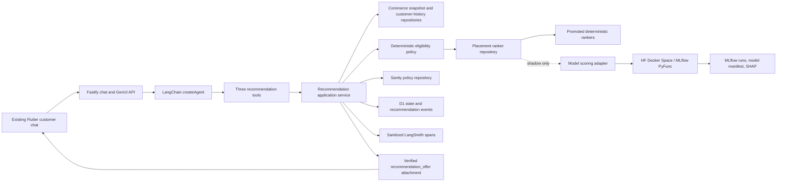

# KFC chat-first product recommendation POC

Status: implementation-ready

Approved decision date: 2026-07-27

Implementation base: `4246c6b2635a8f03931a7f275407ecc4a4d2ef1b`

Base branch: `prototype/kfc-modifier-upsell-ranker`

Agent foundation: LangChain `createAgent` on `codex/kfc-kiss-model-agnostic`

This is the canonical execution handoff for the KFC product recommendation
POC. The linked Wayfinder tickets contain the detailed decision record; this
document turns those decisions into one dependency-ordered build contract.

## 1. Outcome

Build an end-to-end recommendation system that:

- recommends through the existing KFC customer-chat experience;
- supports Local Favorites, For You, Modifier Upsell, and Smart Cross-sell;
- keeps eligibility, merchandising authority, state transitions, and basket
  mutations deterministic;
- lets the configured `BaseChatModel` choose natural recommendation timing and
  wording through the existing LangChain `createAgent` loop;
- serves the empirically retained deterministic rankers by default;
- invokes the qualified LightGBM and Keras 3 models in shadow mode through a
  swappable model adapter;
- allows protected technical comparison with learned output without presenting
  it as the promoted customer policy;
- persists current flow state and append-only recommendation evidence in D1;
- uses Sanity Free as real POC merchandising authority;
- exposes customer evidence in the existing Flutter chat, workflow evidence in
  LangSmith, model evidence in MLflow/SHAP, and durable state through the
  protected admin envelope and Cloudflare D1 Console; and
- qualifies conversational behavior with Codex role-play and independent Codex
  evaluation outside application code.

The POC is complete when the flagship returning-customer journey and the
held-out narrative set run through the real HTTP, LangChain, GenUI, D1, Sanity,
and shadow-model boundaries and produce the acceptance evidence in section 15.

## 2. Explicit boundaries

### In scope

- Complete platform-neutral recommendation contracts.
- Complete candidate enumeration and deterministic eligibility evidence.
- Real Sanity policy reads plus equivalent versioned test fixtures.
- Durable once-per-order-flow stage policy.
- Customer-chat recommendation cards and verified actions.
- Deterministic serving rankers and optional learned technical output.
- Public Hugging Face model artifact and Docker Space for shadow inference.
- Synthetic-world and behavioral qualification evidence.

### Out of scope

- Production KFC kiosk integration or assumptions about its client technology.
- Real POS/history ingestion without a source system and access contract.
- Production scale, latency, uptime, retry, or disaster-recovery engineering.
- Real-world AOV or conversion claims from synthetic evidence.
- A separate Streamlit, Flutter simulator, CMS client, or database dashboard.
- A fifth proactive “Single Upsell” stage.
- ANN/vector retrieval, a vector database, a generic Hugging Face recommender,
  or an LLM acting as the ranker.
- Contextual-bandit serving. Vowpal Wabbit remains simulation-only.
- Automatic basket mutation from recommendation text or tool output.
- Exact-response or exact-tool-sequence conversational tests.

## 3. Non-negotiable invariants

1. A client sends context, never an authoritative candidate list.
2. Eligibility enumerates and records every potential candidate before ranking.
3. A ranker sees only eligible candidates and model-visible, pre-decision
   features.
4. Sanity may exclude, suppress, replace, boost, or pin, but cannot resurrect
   an ineligible action.
5. The LLM cannot determine customer identity, eligibility, ranking,
   merchandising authority, stage transitions, or basket effects.
6. A recommendation decision is not an impression.
7. A selection is not a successful cart mutation.
8. Checkout value is attributed only when the exact recommended action survives
   in the final basket.
9. Silence is not an explicit negative label.
10. Empty and suppressed decisions consume the proactive placement attempt.
11. Natural-language acceptance cannot mutate the basket.
12. Synthetic evidence is always labelled as simulated.
13. No recommendation compatibility layer preserves the removed generic
    add-on tool; the three typed recommendation tools replace it.

## 4. Target architecture



The Fastify backend owns the recommendation use case. The Python service scores
already-eligible rows; it does not own API authority, candidate generation,
eligibility, Sanity resolution, state, or effects.

## 5. Placement contract

| Placement | Trigger and identity | Serving ranker | Output |
|---|---|---|---|
| `local_favorite` | First food/menu/order intent for anonymous, unlinked, or zero-history customer | `contextual-popularity-v1` | One product action |
| `for_you` | First food/menu/order intent for a verified linked customer with at least one completed prior order | `for-you-affinity-v1` | One product action |
| `modifier_upsell` | Immediately after a newly added eligible cart line | `incremental-value-v1` | Exactly one positive-price compatible modifier action |
| `smart_cross_sell` | After Modifier Upsell resolves, is dismissed, is ignored by the next turn, or returns empty | `smart-cross-blend-v1` | One slate, three products by default and four maximum |

Starter selection is mutually exclusive. `recommendStarter` chooses
`for_you` only from verified identity and completed-order evidence; otherwise it
chooses `local_favorite`.

One Smart Cross-sell slate is one proactive offer even when it contains three or
four selectable product actions. The agent introduces the slate with one short
sentence.

### Serving formulas

All normalizations use training/fixture statistics fixed by ranker version.
Ties use canonical action ID ascending.

`contextual-popularity-v1` uses Bayesian-smoothed order frequency in this
back-off order:

1. store × weekday/weekend × daypart;
2. store × daypart;
3. store;
4. global.

`for-you-affinity-v1` scores:

```text
0.55 × normalized recency-weighted exact-item order frequency
+ 0.25 × normalized recency-weighted category affinity
+ 0.20 × contextual-popularity-v1
```

Only events strictly before `decisionTime` contribute. Completed orders use
exponential decay with a 90-day half-life. Candidates already in the cart,
previously shown in the order flow, or ineligible at the current store are
removed before scoring.

Local Favorites and For You are versioned deterministic POC policies, not
empirically promoted learned models. Their technical reports disclose that
boundary and make no learned-uplift claim.

`incremental-value-v1` orders compatible positive-price Modifier Actions by:

```text
log1p(priceDeltaVnd)
```

`smart-cross-blend-v1` is the qualified validation blend:

```text
0.50 × zscore(log1p(2 × storeItemOrderCount + globalItemOrderCount))
+ 0.50 × zscore(activeDiscountRatio)
```

It applies the qualified slate composer after scoring: unique products, no more
than two products from one category, three products by default, and a fourth
only when its score is positive, its category adds diversity, and it fits the
remaining stated budget.

### Qualified learned candidates

| Placement | Learned candidate | Role | Qualification result |
|---|---|---|---|
| Smart Cross-sell | LightGBM | Shadow and protected technical comparison | Learned AOV improved, but NDCG@5 regressed; retain `smart-cross-blend-v1` |
| Modifier Upsell | Native Keras 3 | Shadow and protected technical comparison | AOV interval crossed zero; retain `incremental-value-v1` |

Smart Cross-sell’s untouched simulated AOV delta was +₫3,272 with a paired
95% interval of +₫1,368 to +₫5,347, while NDCG@5 fell by 0.02975. Modifier
Upsell’s untouched simulated AOV delta was +₫44.20 with a paired 95% interval
of −₫19.64 to +₫105.62; NDCG@5 rose by 0.006891. Modifier cold-start evidence
was insufficient because all six fixture cold modifiers are zero-price
substitutions and therefore ineligible for proactive upsell.

The shadow result never changes the customer response in baseline mode. A
protected `learned_technical` profile may select learned output for a deliberate
technical comparison; every such decision must state that source in its
version bindings and trace.

## 6. Canonical domain

Create `src/recommendations/domain/` as the single TypeScript domain boundary
and `contracts/recommendations/v1/` as transport authority.

Canonical version constants:

```text
KFC_RECOMMENDATION_API_VERSION=kfc-recommendation-v1
KFC_RECOMMENDATION_STATE_VERSION=kfc-recommendation-state-v1
KFC_RECOMMENDATION_EVENT_VERSION=kfc-recommendation-event-v1
KFC_RECOMMENDATION_POLICY_VERSION=kfc-recommendation-policy-v1
```

Required identities:

- `CommerceEnvironmentId`
- `ProductFamilyId`
- `SellableItemId`
- `ExternalItemAlias`
- `CartLineId`
- `ModifierGroupPath`
- `ModifierOptionId`
- `ModifierActionId`
- `OrderingJourneyId`
- `RecommendationId`
- `RecommendationRequestId`
- `RecommendationEventId`
- `SanityPolicyId`
- `ModelArtifactId`

Money is integer VND wrapped with currency. Instants are ISO-8601 UTC strings;
policy applicability also records the store timezone used.

### Immutable version bindings

Every valid decision binds:

- catalog snapshot;
- modifier graph snapshot;
- store snapshot;
- availability snapshot;
- promotion snapshot;
- cart revision;
- eligibility-policy version;
- Sanity snapshot digest and contributing revisions;
- feature-schema version;
- serving-ranker version;
- shadow-model artifact and calibration versions when invoked;
- experiment/profile version; and
- logging-policy version.

Each commerce snapshot records its app-owned ID and digest, source revision,
observed/effective/expiry times, completeness, environment, and provenance.
Missing, mixed-environment, incomplete, or expired authoritative request
evidence returns `invalid_context`; it must not silently produce candidates.

### Recommendation actions

Use a discriminated union:

- `add_product`: sellable item, quantity, price impact, cart revision;
- `apply_modifier`: parent cart line, parent sellable item, recursive group
  path, option, quantity, price impact, cart revision;
- `replace_cart_line`: existing line plus complete replacement action and price
  impact.

The POC rankers produce `add_product` and `apply_modifier`.
`replace_cart_line` remains in the platform contract for a validated Sanity
replacement, not as an implicit model action.

## 7. Platform-neutral API

Implement the following Fastify endpoints:

```text
POST /v1/recommendations/decide
POST /v1/recommendations/:recommendationId/impressions
POST /v1/recommendations/:recommendationId/outcomes
```

Schemas are authored as JSON Schema/OpenAPI and generated or validated into
TypeScript/Zod and Python/Pydantic. Handwritten language-specific schemas may
add domain helpers but cannot redefine transport fields.

### Decision request

Required fields:

- `schemaVersion`
- `requestId`
- `idempotencyKey`
- `orderFlowId`
- `sessionId`
- `placement`
- `storeId`
- `fulfilmentMode`
- `decisionTime`
- `cart`
- `cartRevision`
- `commerceSnapshotBindings`
- `eligibilityPolicyVersion`
- `experimentProfile`

Optional `verifiedCustomerRef` is accepted only when issued by the backend
identity boundary. Customer prose is never parsed into it.

### Decision response

Required fields:

- `schemaVersion`
- `recommendationId`
- `requestId`
- `orderFlowId`
- `placement`
- `status`
- `decisionSource`
- `primaryOffer`
- `displayFacts`
- `reasonCodes`
- `merchandisingEffects`
- `versionBindings`
- `counts`
- `traceRef`

`status` is `recommended`, `empty`, `suppressed`, `invalid_context`, or
`ineligible_context`.

`decisionSource` is `ranked`, `merchandising_replacement`, `fallback`, or
`suppressed`. Boosts and pins remain candidate-level effects rather than a
different decision source.

`counts` records potential, eligible, ineligible, scored, and displayed
candidate counts plus completeness.

Customer-facing reason codes are limited to:

```text
popular_here
ordered_before
matches_your_history
completes_your_item
completes_your_meal
active_offer
merchandising_selection
```

Internal empty/suppression reason codes are limited initially to:

```text
no_eligible_candidates
placement_already_attempted
placement_not_yet_eligible
verified_history_required
parent_cart_line_required
no_positive_price_modifier
merchandising_suppressed
invalid_context
```

New reason codes require a schema-versioned contract change. Customer text must
come from approved localization or natural phrasing of the verified code; it
cannot add a factual claim.

Normal clients receive only the authoritative customer projection. A protected
technical request may include the complete eligible pre-policy ranking,
baseline scores, shadow scores, and feature reason summary.

### Impression request

An impression is recorded only after the client confirms that the attachment
rendered. It binds recommendation, assistant turn, attachment, rendered action
IDs, positions, render time, cart revision, and action digest.

### Outcome request

Outcome types:

- `selected`
- `explicitly_dismissed`
- `ignored`
- `superseded`
- `cart_mutation_succeeded`
- `cart_mutation_failed`
- `checkout_completed`
- `order_abandoned`
- `order_cancelled`

`selected` does not imply cart success. `ignored` closes the proactive stage but
is not an explicit negative training label.

All three endpoints are idempotent. A repeated canonical decision request
returns the same decision. Event IDs deduplicate impression and outcome writes.

## 8. Eligibility and Sanity resolution

Create:

```text
src/recommendations/eligibility/
src/recommendations/merchandising/
src/recommendations/snapshots/
```

Eligibility owns:

- canonical catalog identity;
- current store and fulfilment availability;
- modifier parent/path compatibility and cardinality;
- promotion validity;
- basket consistency and duplicate suppression;
- verified dietary constraints and evidence;
- starter identity/history qualification;
- stage order and once-per-flow attempts;
- previously shown and rejected targets; and
- positive-price qualification for proactive Modifier Upsell.

Persist an Eligibility Decision for every potential action with policy version,
eligible flag, bounded reason codes, evidence bindings, and digest.

### Sanity document

Implement versioned `recommendationPolicy` documents with:

- app-owned policy ID and schema version;
- name, description, enabled, campaign ID, priority, authored reason;
- placement;
- action: `exclude_target`, `boost_target`, `pin_target`, `replace_slate`, or
  `suppress_placement`;
- ordered app-owned target IDs;
- environment, included/excluded stores, fulfilment, basket-subtotal bounds,
  required/excluded cart products/categories, verified cohorts;
- `startsAt` and optional `endsAt`;
- bounded reason code and approved Vietnamese/English text;
- bounded boost weight or pin position where applicable.

The backend reads one atomically validated published snapshot through a
provider-neutral `MerchandisingPolicyRepository`. Tests read equivalent
versioned local fixtures. Clients never call Sanity directly.

Applicability order:

1. higher priority;
2. greater scope specificity;
3. later activation;
4. stable policy ID.

Resolution order:

1. run hard eligibility;
2. union exclusions;
3. resolve `suppress_placement` or the first valid `replace_slate`;
4. apply the strongest bounded boost per target;
5. apply deterministic pins;
6. apply final response-shape and diversity rules without adding candidates.

CMS Single Upsell is a scoped `replace_slate`, not another proactive stage.

## 9. Durable state and D1

Extend `KfcVerifiedState` with:

```text
recommendationState:
  schemaVersion
  orderFlowId
  stage
  attemptedPlacements[]
  shownActionIds[]
  rejectedActionIds[]
  pendingRecommendation
  recordedOutcomeEventIds[]
  nextEligiblePlacement
```

Stages:

```text
starter_eligible
starter_resolved
modifier_eligible
modifier_pending
modifier_resolved
smart_cross_sell_eligible
smart_cross_sell_pending
complete
```

### State transitions

| Event | From | To |
|---|---|---|
| Starter recommended, empty, suppressed, dismissed, accepted, or ignored | `starter_eligible` | `starter_resolved` |
| Eligible cart line added | `starter_resolved` | `modifier_eligible` |
| Modifier offered | `modifier_eligible` | `modifier_pending` |
| Modifier accepted, dismissed, empty, suppressed, or ignored by next turn | modifier stage | `modifier_resolved` then `smart_cross_sell_eligible` |
| Smart Cross-sell offered | `smart_cross_sell_eligible` | `smart_cross_sell_pending` |
| Smart Cross-sell accepted, dismissed, empty, suppressed, or ignored | smart-cross stage | `complete` |

An explicit `customer_requested` recommendation may run after `complete`, but it
does not reopen proactive stages and must exclude all previously shown actions.

Add `0024_recommendation_events.sql`:

```sql
CREATE TABLE recommendation_events (
  event_id TEXT PRIMARY KEY,
  schema_version TEXT NOT NULL,
  event_type TEXT NOT NULL,
  recommendation_id TEXT,
  request_id TEXT NOT NULL,
  order_flow_id TEXT NOT NULL,
  session_id TEXT NOT NULL,
  placement TEXT NOT NULL,
  occurred_at TEXT NOT NULL,
  recorded_at TEXT NOT NULL,
  actor TEXT NOT NULL,
  action_id TEXT,
  cart_revision TEXT,
  version_bindings_json TEXT NOT NULL,
  payload_json TEXT NOT NULL
);
```

Add indexes on `(order_flow_id, occurred_at, event_id)`,
`(recommendation_id, occurred_at, event_id)`, and
`(session_id, occurred_at, event_id)`.

Add `0025_recommendation_demo_customer_history.sql` with an explicitly mock-only
D1 repository:

```sql
CREATE TABLE recommendation_demo_customer_history (
  customer_ref TEXT PRIMARY KEY,
  fixture_label TEXT NOT NULL,
  linked INTEGER NOT NULL CHECK (linked IN (0, 1)),
  completed_orders_json TEXT NOT NULL,
  favorites_json TEXT NOT NULL,
  updated_at TEXT NOT NULL
);
```

The application depends on `CustomerHistoryRepository`; only the POC fixture
adapter depends on this table. Seed at least:

- a clearly labelled linked returning customer with completed orders;
- a linked customer with no completed orders; and
- an anonymous/unlinked journey.

The existing `pack_state_projections` table remains the current-state store.
`recommendation_events` is the independent append-only audit/analytics history.

## 10. Model package and Hugging Face

Add one placement-aware MLflow PyFunc package under:

```text
services/kfc-recommendation-simulator/src/kfc_recommendation_simulator/serving/
```

The package contains:

- Smart Cross-sell LightGBM artifact;
- Modifier Upsell native Keras 3 artifact;
- both feature schemas;
- both calibration artifacts;
- ranker manifests;
- the two exact qualification result digests;
- one input/output signature; and
- a placement router that performs only feature validation, scoring,
  calibration, and reason contribution projection.

Input is a batch of eligible request-candidate rows plus placement and exact
feature-schema version. Output contains candidate action ID, calibrated
probability, expected-value score, model artifact ID, calibration ID, feature
schema, and bounded reason contributions.

Publish the immutable bundle to a public Hugging Face model repository. Git
stores:

- repository ID;
- pinned revision;
- file digests;
- MLflow model signature;
- qualification digests; and
- reproducible package command.

Do not commit generated training datasets or duplicate model binaries to the
application repository.

Deploy the pinned bundle in one public Hugging Face Docker Space using MLflow’s
standard inference server. The backend adapter calls `/invocations`. This uses
[MLflow Model Serving](https://mlflow.org/docs/latest/ml/deployment),
[Docker Spaces](https://huggingface.co/docs/hub/main/spaces-sdks-docker), and
the free CPU Basic tier documented in the
[Spaces overview](https://huggingface.co/docs/hub/main/spaces-overview).
Free-space sleep is acceptable for the non-authoritative shadow path; it is not
used as evidence of production availability.

Configuration:

```text
KFC_RECOMMENDATION_SHADOW_URL
KFC_RECOMMENDATION_SHADOW_MODEL_REVISION
KFC_RECOMMENDATION_OUTPUT_MODE=baseline|learned_technical
```

Default is `baseline`. `learned_technical` is protected configuration, never a
customer-controlled or model-controlled parameter. Shadow unavailability does
not change the authoritative baseline decision.

## 11. Agent integration

Delete the legacy generic add-on tool from:

- `RecommendationClient`;
- `TOOL_NAMES` and all tool result maps;
- tool boundary, schema, description, executor, verified-state, publication,
  GenUI selector, fixture, and test registries.

Add:

```text
recommendStarter
recommendModifierUpsell
recommendSmartCrossSell
```

All three tools call the same `RecommendationApplicationService`.

### Model-visible tool inputs

`recommendStarter`:

```text
requestKind: proactive | customer_requested
```

`recommendModifierUpsell`:

```text
requestKind: proactive | customer_requested
parentCartLineId: string
```

`recommendSmartCrossSell`:

```text
requestKind: proactive | customer_requested
```

Every optional semantic is represented by an explicit nullable field if the
provider-portable schema requires a stable property set. Execution injects
session, verified customer, store, cart, stage, snapshots, and policy versions.
The model cannot author those values.

Tool availability is derived from durable typed state before each agent
invocation. Do not route customer prose with keyword, phrase, or regular
expression logic. The normal model loop chooses whether and when to call an
available tool.

### Prompt contract

The KFC system prompt tells the agent:

- be slightly proactive after genuine food/menu/order intent;
- offer at most one recommendation attachment at a time;
- use one short sentence grounded only in returned facts and reason codes;
- never interrupt safety, checkout, fulfilment, or an unresolved request;
- never invent availability, popularity, history, promotion, price,
  compatibility, or CMS rationale;
- never mention an empty or suppressed internal recommendation result;
- never mutate a basket through prose; and
- never repeat a proactive placement in one order flow.

## 12. Recommendation GenUI

Add `recommendationOffer` to the existing KFC GenUI discriminated union and a
matching Flutter widget under the current customer-chat GenUI renderer.

The attachment contains:

- recommendation and order-flow IDs;
- placement and decision source;
- one starter, one modifier, or a three/four-product Smart Cross-sell slate;
- verified names, images, price and price impact;
- bounded reason code and approved display text;
- one `Add to order` action per displayed recommendation;
- one attachment-level `No thanks` action;
- issued and expiry times;
- cart revision;
- authoritative version binding digest; and
- one-shot authority bound to session, customer, assistant turn, attachment,
  action digest, exact target, and cart revision.

`Add to order` forwards the typed action through the existing trusted GenUI
action route. The backend revalidates authority and current cart revision,
executes the exact product/modifier mutation, and records selected plus
mutation-success/failure events.

`No thanks` records an explicit dismissal and advances durable stage state.
A narrow agent tool may record an unambiguous natural-language decline only for
the current pending recommendation. Natural-language acceptance must resurface
or reference the verified Add action.

Reuse the current product card, modifier selector primitives, verified remote
media, action chrome, loading, answered, expired, and blocked states. Do not add
a new page.

## 13. Observability and technical evidence

### LangSmith

Create sanitized spans:

```text
recommendation.decide
recommendation.enumerate_candidates
recommendation.eligibility
recommendation.baseline_rank
recommendation.shadow_rank
recommendation.sanity_resolve
recommendation.persist
recommendation.impression
recommendation.outcome
```

Metadata may include opaque session, order-flow, request, recommendation,
trace, placement, reason, policy, ranker, artifact, schema, counts, duration,
and digest fields. It must exclude raw customer prose, addresses, payment data,
credentials, and private reasoning.

### MLflow and SHAP

MLflow remains the model evidence surface. Preserve:

- dataset and qualification digests;
- seeds and split membership;
- feature and model manifests;
- calibration metrics;
- aggregate and per-slice metrics;
- model artifact;
- serving signature; and
- SHAP summaries for supported tree models.

### Durable state

Extend the protected admin envelope with the current recommendation state,
latest decision summary, pending action, and correlation IDs. Detailed history
remains in D1 Console through `recommendation_events`.

## 14. Behavioral qualification

Change `scenario:live` from an in-memory `MemoryStore` runner to a thin
stdin/evidence bridge over the actual running chat HTTP ingress and D1
persistence.

Extend the stdin protocol:

```json
{"type":"user","text":"<improvised customer message>"}
{"type":"action","assistantTurnId":"...","attachmentId":"...","actionId":"..."}
{"type":"finish","note":"<optional reviewer note>"}
```

The harness validates and forwards a referenced action; it never chooses the
action itself.

Narrative files retain only:

- goal;
- preconditions;
- disposition;
- risks;
- intended final state; and
- illustrative conversational turns where useful.

They contain no required wording, word matching, exact tool sequence, or
deterministic behavioral assertion.

Codex subagent A receives the held-out narrative and improvises one turn/action
at a time. After the run, a fresh Codex subagent B receives only the evidence
packet and judges `successful`, `partial`, `unsuccessful`, or
`insufficient_evidence` with evidence citations. Application code never invokes
Codex.

Required narratives:

1. returning customer: For You → add → Modifier Upsell dismiss → Smart
   Cross-sell add;
2. anonymous customer: Local Favorite;
3. Modifier Upsell accepted;
4. Modifier Upsell empty;
5. Sanity replacement;
6. Sanity suppression;
7. explicit customer-requested recommendation after proactive completion; and
8. once-only enforcement.

## 15. Acceptance evidence

### Deterministic contracts

Tests must prove:

- JSON/OpenAPI cross-language schema parity;
- complete candidate enumeration;
- every hard eligibility rule and zero invalid output;
- Sanity precedence and traceability;
- ranker formulas, slate limits, and tie-breaking;
- feature time-boundary and no oracle leakage;
- durable stage transitions and once-only behavior;
- idempotent decisions and events;
- stale/replayed/wrong-cart GenUI rejection;
- exact product and modifier basket mutation;
- impression-after-render authority;
- D1 migrations, state, and replay;
- protected model-profile selection;
- shadow score provenance;
- LangSmith trace correlation and redaction; and
- `scenario:live` HTTP/D1/action forwarding.

Run normal package scripts:

```bash
cd services/kfc-agent-backend
npm run lint
npm run typecheck
npm test

cd ../kfc-recommendation-simulator
uvx ruff check src tests
uv run python -m compileall -q src tests
uv run python -m unittest discover -s tests -v
```

Flutter proof must include widget/unit coverage for `recommendationOffer`,
trusted action authority, stale action handling, and real integration-test
screenshots of the flagship chat flow. Presentation screenshots do not replace
integration proof.

### Model evidence

Preserve:

- Smart Cross-sell digest
  `e76c7641d48a9f47f0da084ca77f30ceb8df6c31c2ebee65eef15d52c80cda80`;
- Modifier Upsell digest
  `75f1d02a4e230e901eb222b26268b255f46842483ad77f04e2192ea74d81de26`;
- Hugging Face model repository and pinned revision;
- Docker Space URL and health/inference capture;
- MLflow run IDs and serving signature;
- baseline and learned outputs for the same held-out requests; and
- the synthetic-evidence disclaimer.

### Flagship demo

1. Select the clearly labelled seeded returning customer.
2. Express a food/order intent.
3. Observe a For You recommendation.
4. Add it through verified GenUI.
5. Observe one compatible positive-price Modifier Upsell.
6. Select No thanks.
7. Continue the conversation and observe one Smart Cross-sell slate.
8. Add one cross-sell product.
9. Confirm no further proactive recommendation appears.
10. Open the correlated LangSmith trace.
11. Open the protected durable recommendation state.
12. Show the D1 event history.
13. Show MLflow/SHAP and the baseline-versus-shadow comparison.

### Evidence packet

Each behavioral run produces:

- narrative and immutable digest;
- complete user/assistant transcript;
- tool calls and sanitized results;
- rendered attachment and submitted action references;
- recommendation events;
- final durable pack state;
- LangSmith correlation;
- model and Sanity version bindings;
- role-player identity and model metadata;
- evaluator verdict and citations; and
- source commit and environment manifest.

## 16. Dependency-ordered execution plan

### Phase 0 — provenance and fixtures

1. Branch from `4246c6b2`.
2. Freeze the current KFC fixture digests and benchmark result digests.
3. Add contract-generation tooling and test commands.
4. Provision the Sanity Free project/dataset and Hugging Face repositories;
   record only public identifiers and secret names in Git.

Exit: reproducible environment manifest and no uncommitted generated artifact.

### Phase 1 — canonical contracts

1. Add recommendation domain identities, request/response/actions/events.
2. Add JSON Schema/OpenAPI authority and TypeScript/Python validation.
3. Add immutable snapshot and version-binding contracts.
4. Replace the context-free client interface at compile time.

Exit: schema parity and contract tests pass.

### Phase 2 — deterministic recommendation core

1. Implement complete candidate enumeration and eligibility.
2. Implement the four serving rankers and Smart Cross-sell slate composer.
3. Implement Sanity schema, fixture repository, live repository, and resolver.
4. Implement the application service and protected technical projection.

Exit: deterministic replay from request and evidence digest returns the same
decision and complete eligibility trace.

### Phase 3 — durable state and API

1. Add D1 migrations and repositories.
2. Extend KFC pack state and stage transitions.
3. Implement decide, impression, and outcome routes with idempotency.
4. Expose protected state and trace correlation.

Exit: API, D1, replay, once-only, and concurrency tests pass.

### Phase 4 — ML shadow package

1. Convert qualified artifacts into one signed MLflow PyFunc bundle.
2. Verify predictions against benchmark artifacts.
3. Publish the pinned Hugging Face model revision.
4. Deploy the Docker Space.
5. Add the backend shadow adapter and protected output mode.

Exit: baseline and shadow score the same eligible rows with exact artifact
provenance; default customer output remains baseline.

### Phase 5 — agent and GenUI integration

1. Add the three typed tools and durable dynamic availability.
2. Add slightly proactive prompt policy.
3. Add backend `recommendationOffer` selection and trusted actions.
4. Add Flutter parsing, rendering, action forwarding, and interaction states.
5. Remove every legacy generic add-on recommendation path.

Exit: the flagship journey works through real chat HTTP and D1.

### Phase 6 — evidence and qualification

1. Add recommendation LangSmith spans and redaction.
2. Adapt `scenario:live` to HTTP/D1 and verified actions.
3. Run deterministic package suites and Flutter integration proof.
4. Run held-out Codex role-player/evaluator pairs.
5. Assemble the acceptance packet and demo checklist.

Exit: all evidence in section 15 exists and all failures are separated into
implementation, live-model behavior, or external-service blockers.

## 17. Suggested implementation ownership

The phases may run in parallel only after their declared prerequisites:

| Workstream | May begin after | Owns |
|---|---|---|
| Contracts | Phase 0 | Cross-language schemas and domain types |
| Sanity and eligibility | Contract identities | Policy schema/repository/resolver and candidate evidence |
| D1 and API | Transport and state schemas | Migrations, repositories, routes, idempotency |
| Model packaging | Frozen qualification artifacts | MLflow bundle, Hugging Face model and Space |
| Agent integration | Tool and state contracts | Tools, availability, prompt, traces |
| Flutter GenUI | Attachment/action schema | Existing chat renderer and interaction proof |
| Qualification | All runtime paths | Narratives, HTTP harness, Codex evidence packet |

No workstream may redefine a shared contract privately. Contract changes land
first and consumers update against the same revision.

## 18. Manual setup checklist

The implementation executor must obtain or create:

- Sanity project ID, public dataset name, read token if required, and Studio
  project;
- public Hugging Face model repository;
- public Hugging Face Docker Space;
- Hugging Face write token used only during publication;
- LangSmith project and API key;
- OpenAI model credentials already supported by the KISS runtime; and
- Cloudflare D1 database and Worker secrets.

Expected secret names are documented in `.env.example` and Worker configuration
without values. No credential enters Git, MLflow artifacts, LangSmith metadata,
scenario evidence, or D1 payloads.

## 19. Decision provenance

- [Compare headless CMS options for recommendation merchandising](https://github.com/ThangVuNguyenViet/hackathon/issues/76)
- [Compare recommender frameworks and model families for the POC](https://github.com/ThangVuNguyenViet/hackathon/issues/72)
- [Specify the canonical recommendation data and eligibility contract](https://github.com/ThangVuNguyenViet/hackathon/issues/77)
- [Set the evaluation splits, metrics, and model-selection gates](https://github.com/ThangVuNguyenViet/hackathon/issues/71)
- [Specify Sanity merchandising policies and override precedence](https://github.com/ThangVuNguyenViet/hackathon/issues/75)
- [Specify the platform-neutral recommendation API and telemetry schema](https://github.com/ThangVuNguyenViet/hackathon/issues/78)
- [Prototype the mock chatbot recommendation-tool integration](https://github.com/ThangVuNguyenViet/hackathon/issues/82)
- [Prototype the synthetic behavioral world and logged-impression generator](https://github.com/ThangVuNguyenViet/hackathon/issues/74)
- [Benchmark and choose the Smart Cross-sell product ranker](https://github.com/ThangVuNguyenViet/hackathon/issues/73)
- [Benchmark and choose the Modifier Upsell ranker](https://github.com/ThangVuNguyenViet/hackathon/issues/80)

The closed Flutter showcase ticket is a scope boundary: customer presentation
belongs in the existing chat, while technical evidence uses the dedicated tools
named above.
